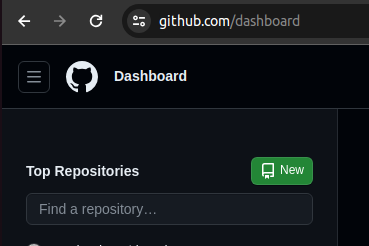
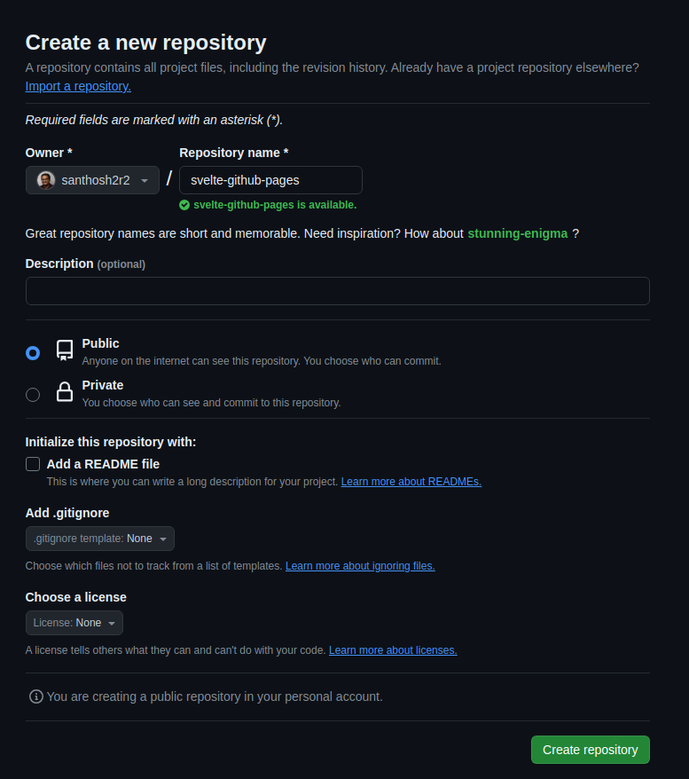
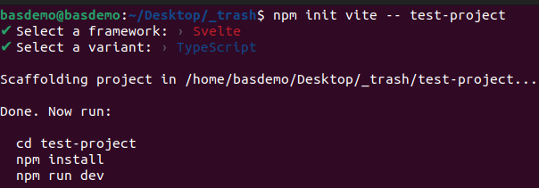
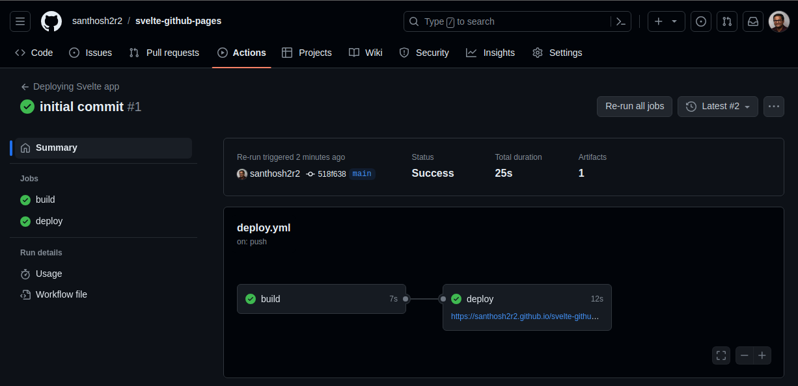
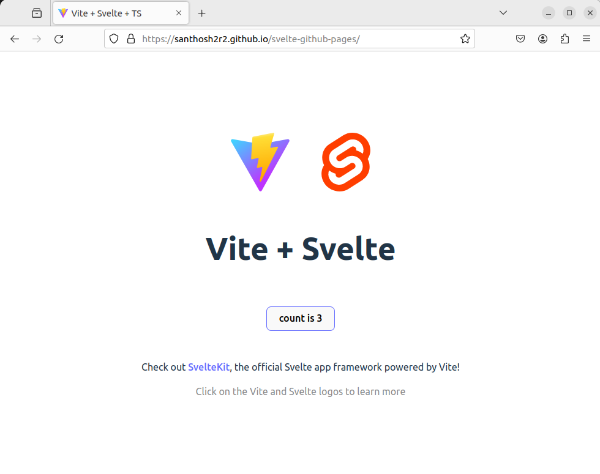
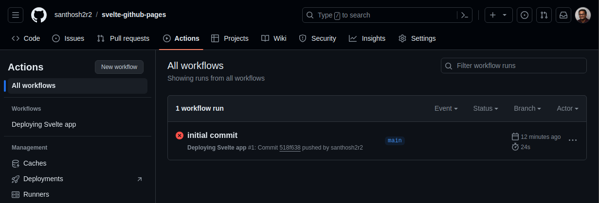
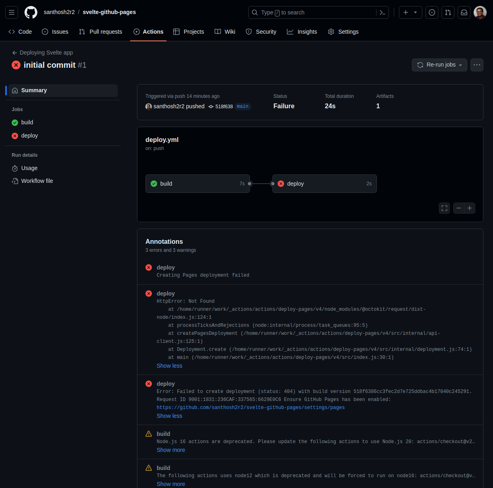

import { Steps, FileTree } from '@astrojs/starlight/components';


With giants in the Frontend-Framework world like `React` and `Angular`, `Svelte` the underdog has seen an tremendous growth among the developers and within the community since its inception in 2016.

Take a look at the results of **StateOfJs** survey [here](https://2022.stateofjs.com/en-US/libraries/front-end-frameworks/)


:::note
This post assumes that you already have an __GitHub__ account.

GitHub is a cloud based platform, where developers can store, manage and share projects. You can create a free account [here](https://github.com/).
:::

## Create a GitHub Project

After creating a new GitHub account or signing into your account, the __dashboard__ page opens.

By clicking the `New` button, create a new project.



Enter a project name and the visibilty should be `public`. This is because, for Free account, only "public" projects can publish using __GitHub Pages__.



### Enable GitHub Pages

In the GitHub project, do the following steps

1. Navigate to `Settings` tab
2. Select `Pages` from the sidebar
3. Make sure under **Source**, `GitHub Actions` is selected

That all you need to do for now. 


:::tip
`Pages` also allows the possibility to host it under your domain.
:::


## Setup a svelte project

:::caution[Pre-requisites]

- Have an IDE (eg. `VS Code`) installed.
- The latest LTS version of `NodeJs` and `git` must also be installed in the local machine.

:::

In this post, we are going to look into a basic `Svelte` project and not **SVELTEKIT** based app.

<Steps>
1. Create svelte project.

    ```sh frame="none"
    npm init vite -- test-project
    ```
2. Choose the option `Svelte` and language of your choice, here I have selected `Typescript`.

    

3. Exceute the following commands, to check whether the development server starts.

    ```sh frame="none"
    # navigate to the project folder
    cd test-project

    # Install the node modules
    npm install

    # Start the dev server
    npm run dev
    ```
4. The server should be started at http://localhost:5173/

5. Open the project in `VS Code`. The project structure should like this.

    <FileTree>

    - index.html
    - **package.json**
    - package-lock.json
    - node_modules/
      - ...
    - public
      - vite.svg
    - README.md
    - src
      - app.css
      - App.svelte  Starting point for svelte-projects
      - assets
        - svelte.svg
      - lib
        - Counter.svelte
      - main.ts
      - vite-env.d.ts
    - svelte.config.js
    - tsconfig.json
    - tsconfig.node.json
    - vite.config.ts

    </FileTree>

</Steps>
### Update `vite.config.ts` file
```diff title="vite.config.ts" lang="ts"
  import { defineConfig } from 'vite'
  import { svelte } from '@sveltejs/vite-plugin-svelte'

  // https://vitejs.dev/config/
  export default defineConfig({
+    base:'svelte-github-pages', // project slug from GitHub
    plugins: [svelte()],
  })
```

### Create workflow file

In order to deploy to GitHub Pages, create a file `deploy.yml` in the folder __.github/workflows__ 

<FileTree>
- .github
  - workflows
    - **deploy.yml**
- index.html
- package.json
- ...
</FileTree>

Copy the following contents into the file.

```yml title="deploy.yml"
name: Deploying Svelte app

on:
  push:
    branches: [ main ]
  workflow_dispatch:

# Allow this job to clone the repo and create a page deployment
permissions:
  contents: read
  pages: write
  id-token: write

jobs:
  build:
    runs-on: ubuntu-latest
    steps:
      - uses: actions/checkout@v2
      - name: Install and Build
        run: |
          npm install
          npm run build

      - name: Upload artifact
        uses: actions/upload-pages-artifact@v3
        with:
          name: github-pages
          path: dist
          retention-days: 1
      
  deploy:
    needs: build
    runs-on: ubuntu-latest
    environment:
      name: github-pages
      url: ${{ steps.deployment.outputs.page_url }}
    steps:
      - name: Deploy to GitHub Pages
        uses: actions/deploy-pages@v4
        id: deployment
```

## Upload the project

Now save its time to create the initial commit and upload the project to GitHub. Follow the following commands

<Steps>
1. Initialize Git Repo
   ```sh frame="none"
   git init
   ```
2. Add files and write the commit message
   ```sh frame="none"
   git add . && git commit -m "initial commit"
   ```
3. Setup the remote origin. Change the URL according to your project.
   ```sh frame="none"
   git remote add origin https://github.com/santhosh2r2/svelte-github-pages.git
   ```
4. Push the commit to remote repository
   ```sh frame="none"
   git push origin main
   ```
</Steps>

### Reviewing GitHub Actions

After the initial commit, go to the project in GitHub website. Under the tab `Actions`, you can see a `1 workflow run`.

A successfully completed job looks like this below. And the website is hosted under https://santhosh2r2.github.io/svelte-github-pages/



The final website should look below.



:::tip

If you see a white screen, when you navigate to the website, make sure to update `vite.config.ts` file.

Refer [Config file update](#update-viteconfigts-file)

:::

:::caution
**Debugging** is an essentail part of any development. If the worklow has failed, like below, then just click on the worklow to get more details.



Upon opening the run, it is evident from the third message, that GitHub Pages is not enabled. Refer Section [Enabling GitHub Pages](#enable-github-pages)



After enabling pages, just rerun the job.


:::

## Next steps

Now you have a svelte project deployed in GitHub and made available for everyone. 

Have fun making your next project. 
:::danger

Make sure you dont upload any sensitive information (like passwords, access details, etc.)

::::


