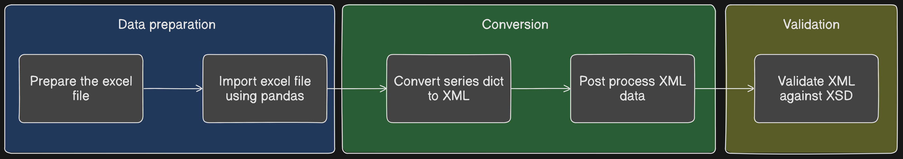

import { Steps, Aside, TabItem, Tabs, FileTree } from '@astrojs/starlight/components';

## Introduction

Today I am came across a task, which required me to generate few XML files. I asked myself, whether I want to spend hours manually creating these XML files or why not automate with 🐍 python and excel.

The charm about using excel is that it gives a better overview of the data. (atleast in my case). Now combined with this thought, need to come about a strategy on deciding the schema for the excel table. 

:::note
For the purpose of the demonstration, I will be using sample data, which can be adapted accordingly.
:::

## Prerequisite

- Excel (or Libre Office)
- Python environment (preferrably VENV)

<Aside type="tip" title="Sample XML and XSD">
    <details>
        <summary>Here are the `XML` and `XSD` with which I am going to work with.</summary>

        <Tabs>
            <TabItem label="person.xml">
```xml
<?xml version="1.0" encoding="UTF-8"?>
<person xmlns="http://www.example.com/person" xmlns:xsi="http://www.w3.org/2001/XMLSchema-instance"
    xsi:schemaLocation="http://www.example.com/person person.xsd">
    <personalInfo>
        <name>John Doe</name>
        <email>john.doe@example.com</email>
        <address>
            <houseNumber>123</houseNumber>
            <city>Sample City</city>
            <pincode>123456</pincode>
        </address>
    </personalInfo>
    <household>
        <children>
            <child name="Alice" />
            <child name="Bob" />
        </children>
        <married>yes</married>
        <partner age="32" name="Jane Doe"></partner>
    </household>
</person>
```
            </TabItem>
            <TabItem label="person.xsd">
```xml
<?xml version="1.0" encoding="UTF-8"?>
<xs:schema xmlns:xs="http://www.w3.org/2001/XMLSchema" targetNamespace="http://www.example.com/person" xmlns="http://www.example.com/person" elementFormDefault="qualified">

  <!-- Root element -->
  <xs:element name="person">
    <xs:complexType>
      <xs:sequence>
        
        <!-- Personal Info -->
        <xs:element name="personalInfo">
          <xs:complexType>
            <xs:sequence>
              <xs:element name="name" type="xs:string"/>
              <xs:element name="email">
                <xs:simpleType>
                  <xs:restriction base="xs:string">
                    <xs:pattern value="[a-zA-Z0-9._%+-]+@[a-zA-Z0-9.-]+\.[a-zA-Z]{2,}"/>
                  </xs:restriction>
                </xs:simpleType>
              </xs:element>
              <xs:element name="address">
                <xs:complexType>
                  <xs:sequence>
                    <xs:element name="houseNumber" type="xs:string"/>
                    <xs:element name="city" type="xs:string"/>
                    <xs:element name="pincode" type="xs:string"/>
                  </xs:sequence>
                </xs:complexType>
              </xs:element>
            </xs:sequence>
          </xs:complexType>
        </xs:element>
        
        <!-- Household -->
        <xs:element name="household">
          <xs:complexType>
            <xs:sequence>
              <xs:element name="children">
                <xs:complexType>
                  <xs:sequence>
                    <xs:element name="child" maxOccurs="unbounded">
                      <xs:complexType>
                        <xs:attribute name="name" type="xs:string" use="required"/>
                      </xs:complexType>
                    </xs:element>
                  </xs:sequence>
                </xs:complexType>
              </xs:element>
              <xs:element name="married">
                <xs:simpleType>
                  <xs:restriction base="xs:string">
                    <xs:enumeration value="yes"/>
                    <xs:enumeration value="no"/>
                  </xs:restriction>
                </xs:simpleType>
              </xs:element>
              <xs:element name="partner">
                <xs:complexType>
                  <xs:attribute name="name" type="xs:string" use="required"/>
                  <xs:attribute name="age" type="xs:integer" use="required"/>
                </xs:complexType>
              </xs:element>
            </xs:sequence>
          </xs:complexType>
        </xs:element>
        
      </xs:sequence>
    </xs:complexType>
  </xs:element>

</xs:schema>
```
            </TabItem>
        </Tabs>
    </details>
</Aside>

## Setup and inital scripts

<Steps>
1. In the python environment install the packages. Using `poetry` execute the following commands

    ```sh frame="none"
    # Setup an environment
    poetry init

    ```
    ```sh frame="none"
    # Add the packages
    poetry add pandas openpyxl lxml
    ```
2. The final folder structure should look like Below
    <FileTree>

    - docs
      - Persons.xlsx
    - source
      - person.xml
      - person.xsd
    - scripts
      - **create_xml_from_excel.py**
      - validator.py
    - .gitignore
    - pyproject.toml

    </FileTree>
</Steps>

## Workflow


## Implementation

### Data prepration - Excel file

<Aside type="note" title="Table definition">
In the excel file, I have created 3 columns. 
- Column 1 represent `parent` node 
- Column 2 represent `child` node
- Column 3 represent `attribute`

- Column 4 has the flattened key for each entry. This is required to convert the dataset to a JSON object. (I will explain this shortly.)
- Column 5 and above will have the actual data

- Row 1: contains an identifier. This is user-baised and does not have much meaning for conversion.
- Row 2: under `key` cell, it should be called `CREATED`. When set to `True`, it will be ignored during the execution of the script
- Row 3+ should contain dataset entries
</Aside>

<Aside type="caution">
The **key** column can be populated based on the Columns 1-3. A simple Excel formula to concatenate the string should suffice.

```excel
=CONCATENATE(A3,IF(B3<>"","."&B3,""),IF(C3<>"","@"&C3,""))
```
</Aside>


#### Sample excel file data


|              |                     | **Attributes** | **key**                          | **Person 1**         | **Person 2**         |
|--------------|---------------------|----------------|----------------------------------|----------------------|----------------------|
|              |                     |                | CREATED                          | FALSE                | FALSE                |
| personalInfo | name                |                | personalInfo.name                | John Doe             | Jane Doe             |
| personalInfo | email               |                | personalInfo.email               | john.doe@example.com | jane.doe@example.com |
| personalInfo | address.houseNumber |                | personalInfo.address.houseNumber | 123                  | 155                  |
| personalInfo | address.city        | city           | personalInfo.address.city        | Sample City          | Test-city            |
| personalInfo | address.pincode     | pincode        | personalInfo.address.pincode     | 123456               | 987546               |
|              |                     |                |                                  |                      |                      |
| household    | children            |                | household.children               | Alice,Bob            | Charlie,Devil        |
| household    | married             |                | household.married                | yes                  | no                   |
| household    | partner             | age            | household.partner@age            | 32                   | 99                   |
| household    | partner             | name           | household.partner@name           | Jane Doe             | Johnny Boy           |


### Scripts to Data Import and Processing

#### `create_xml_from_excel.py` 

<Steps>

1. `import` packages

2. read excel file
   ```py
    from lxml import etree
    import pandas as pd
    import json
    import os
    from xml.dom.minidom import parseString
    import xml.etree.ElementTree as ET
    from validator import validate_xml


   ```


2. Drop columns and create `xml files`

</Steps>

### Execution


> Activate the python virtual environment using the command `poetry shell`