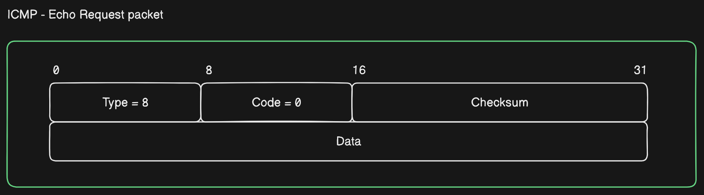
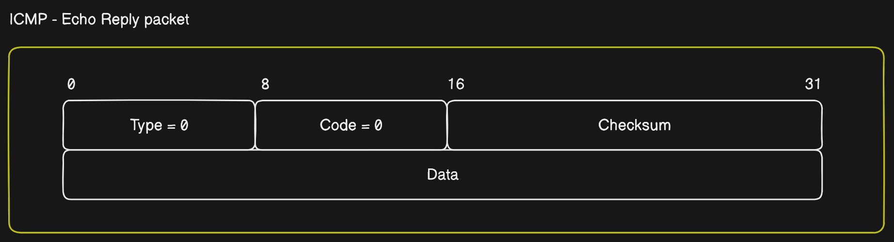
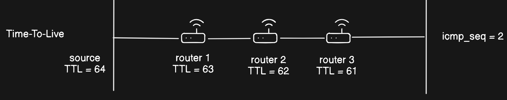

## Introduction

**Ping** is a utility tool used for monitoring the accessibility of host available in a network. It is virtually installed in every operating system that has networking capability.

## A brief history

- The ping utility was written by **[Mike Muuss](https://en.wikipedia.org/wiki/Mike_Muuss)** in December **1983** during his time at the Ballistic Research Laboratory, now the [US Army Research Laboratory](https://en.wikipedia.org/wiki/US_Army_Research_Laboratory). 
- A remark by **[David Mills](https://en.wikipedia.org/wiki/David_L._Mills)** on using **ICMP** echo packets for _IP_ network diagnosis and measurements prompted Muuss to create the utility to troubleshoot network problems.  
- He named it after the sound that sonar makes, since its methodology is analogous to sonar's echolocation.
- The backronym `Packet InterNet Groper` for PING has been used for over <u>30 years</u>, and although Muuss says that from his point of view PING was not intended as an acronym, he has acknowledged Mills' expansion of the name.

- Further reading:
  - [Story of Ping](https://ftp.arl.army.mil/~mike/ping.html)
  - [Wikipedia link](https://en.wikipedia.org/wiki/Ping_(networking_utility))
  - [Linux source code for ping](https://github.com/torvalds/linux/blob/master/net/ipv4/ping.c)

## How it works?

- Ping operates by means of **Internet Control Message Protocol** (ICMP) packets. 
- Pinging involves sending an `ICMP echo request` to the target host and waiting for an `ICMP echo reply`. 
- The program reports errors, packet loss, and a statistical summary of the results, typically including the minimum, maximum, the mean round-trip times, and standard deviation of the mean.


- The command-line options of the ping utility and its output vary between the numerous implementations. 
- Options may include the size of the payload, count of tests, limits for the number of network hops (TTL) that probes traverse, interval between the requests and time to wait for a response.

Below is the sample execution in `ubuntu` OS.


### Terminologies 

- `ICMP` - The [Internet Control Message Protocol](https://en.wikipedia.org/wiki/Internet_Control_Message_Protocol) (ICMP) is a supporting protocol in the Internet protocol suite. It is used by network devices, including routers, to send error messages and operational information indicating success or failure when communicating with another IP address.

- `Checksum` - The [Internet checksum](https://en.wikipedia.org/wiki/Internet_checksum) is used to detect errors in ICMP packets (including data payload). 

    >
    > The checksum field is the __16 bit one's complement of the one's complement sum of all 16 bit words in the header__. For purposes of computing 
    > the checksum, the value of the checksum field is zero.
    > 

- `Echo Request` - This is an ICMP packet sent by the source machine. In the example, **64 bytes** ICMP packet

    

- `Echo Reply` - Once the packet reaches the destination machine, it sends back an **echo reply** ICMP packet.

    

- `Round Trip Time` - The total time measuring from sending the echo request from the source machine until the echo reply packet is recieved by the source machine.

- `Time To Live` - It is either a counter or a timestamp, which every device (such as an intermediate router) forwarding an IP datagram first decrements the time to live (TTL) field in the IP header by one. If the resulting TTL is 0, the packet is discarded and an ICMP time exceeded message is sent to the datagram's source address.

    

- `Sequence number` - It denotes the number of round-trips initiated by the source machine.


## Sample `ping` implementation

The script requires `administrator` or `root` previliges, since it requires access to sockets.
```py title="ping.py" 

import os
import struct
import socket
import time

def calculate_checksum(packet):
    """Calculate ICMP checksum"""
    checksum = 0
    countTo = (len(packet) // 2) * 2
    
    for count in range(0, countTo, 2):
        thisVal = packet[count + 1] * 256 + packet[count]
        checksum += thisVal
        checksum &= 0xffffffff

    if countTo < len(packet):
        checksum += packet[-1]
        checksum &= 0xffffffff

    checksum = (checksum >> 16) + (checksum & 0xffff)
    checksum += checksum >> 16
    checksum = ~checksum
    checksum &= 0xffff
    checksum = checksum >> 8 | (checksum << 8 & 0xff00)
    return checksum

def send_ping(sock, dest_addr, icmp_id, seq_number):
    """Send ICMP Echo Request"""
    # Header is type (8), code (8), checksum (16), id (16), sequence (16)
    icmp_type = 8  # ICMP Echo Request
    icmp_code = 0
    icmp_checksum = 0
    icmp_packet_id = icmp_id
    icmp_sequence = seq_number
    icmp_payload = b'PingPingPingPingPing'

    # Build ICMP header
    icmp_header = struct.pack("!BBHHH", icmp_type, icmp_code, icmp_checksum,
                              icmp_packet_id, icmp_sequence)
    icmp_checksum = calculate_checksum(icmp_header + icmp_payload)

    # Build ICMP packet
    icmp_packet = struct.pack("!BBHHH", icmp_type, icmp_code, icmp_checksum,
                              icmp_packet_id, icmp_sequence) + icmp_payload

    # Send the packet
    sock.sendto(icmp_packet, (dest_addr, 1))

def receive_ping(sock, icmp_id, seq_number, start_time):
    """Receive ICMP Echo Reply"""
    timeout = 3  # Set timeout to 3 seconds
    while True:
        sock.settimeout(timeout)
        try:
            packet, addr = sock.recvfrom(1024)
            icmp_header = packet[20:28]
            icmp_type, icmp_code, icmp_checksum, \
                icmp_packet_id, icmp_sequence = struct.unpack(
                    "!BBHHH", icmp_header)
            if icmp_packet_id == icmp_id and icmp_sequence == seq_number:
                end_time = time.time()
                return end_time - start_time
        except socket.timeout:
            return None

def ping(host, count=4):
    """Ping the specified host"""
    try:
        dest_addr = socket.gethostbyname(host)
    except socket.gaierror:
        print("Invalid hostname.")
        return

    print(f"Pinging {host} [{dest_addr}] with {count} packets:")

    icmp_id = os.getpid() & 0xFFFF

    for seq_number in range(1, count + 1):
        sock = socket.socket(socket.AF_INET, socket.SOCK_RAW, socket.getprotobyname("icmp"))
        start_time = time.time()
        send_ping(sock, dest_addr, icmp_id, seq_number)
        round_trip_time = receive_ping(sock, icmp_id, seq_number, start_time)
        if round_trip_time is not None:
            print(f"Reply from {dest_addr}: icmp_seq={seq_number} time={round(round_trip_time * 1000, 2)}ms")
        else:
            print("Request timed out.")
        sock.close()

if __name__ == "__main__":
    ping("192.168.80.135")

```

Output
```sh frame="none"
sudo python ping.py
```
```sh frame="none"

# Pinging 192.168.80.135 [192.168.80.135] with 4 packets:
# Reply from 192.168.80.135: icmp_seq=1 time=0.73ms
# Reply from 192.168.80.135: icmp_seq=2 time=0.05ms
# Reply from 192.168.80.135: icmp_seq=3 time=0.06ms
# Reply from 192.168.80.135: icmp_seq=4 time=0.03ms
```