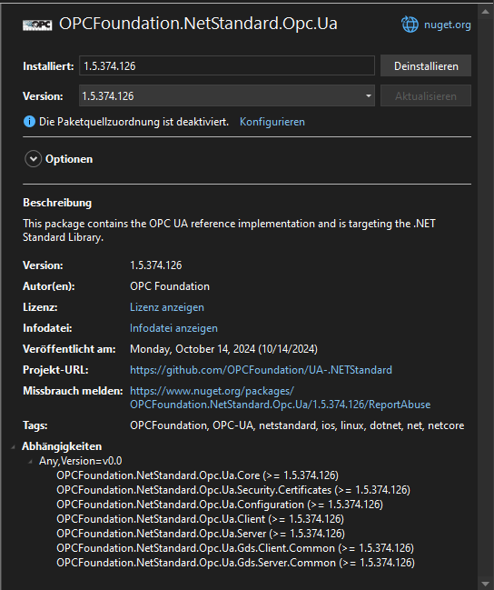

import { Steps, Aside } from '@astrojs/starlight/components';


## Introduction

`OPC-UA` has been established as one of the most common communication protocol in the Industrial Internet of Things (IIoT) spaning from field level to the enterprise level.

This article will show how simple it is to build a server / client projects. The programming language is purely the author's choice. 

What will be built at the end of this article

- OPC-UA Server in `python` having **analog**, **digital** and **string** variables
- OPC-UA Client using `.net winforms`
- Containierize the server

## Let`s build

### The server

The OPC-UA server is going to be developed in python. For the development, create a virtual environment. For this article, I will be using `poetry`. 

<Aside type="note" title="Pro tip"> 

Checkout the installation of Poetry [here](/youtube/general/install/2024-09-09-install-poetry)

</Aside>

<Steps> 
1. Open up a terminal and initialize a virtual environment 
    ```sh frame="none"
    poetry init

2. Install the dependencies
    ```sh frame="none"
    poetry add asyncua
    ```

3. Create a file `server.py`

4. Add the import
    ```py
    import asyncio
    import logging

    from asyncua import Server, ua
    from asyncua.common.methods import uamethod
    ```

5. Create a `main` function and setup `server`
    ```py
    async def main():
        _logger = logging.getLogger(__name__)

        # setup our server
        server = Server()
        await server.init()
        # endpoint is freely defined, provided the schema, ip-address and port number are present
        server.set_endpoint("opc.tcp://0.0.0.0:4840/basdemo/")

        # Add security policies to allow anonymous access
        server.set_security_policy([
            # Allow anonymous access (no security)
            ua.SecurityPolicyType.NoSecurity,
            # TODO: Add other policies if necessary, like Basic128Rsa15, etc.
        ])

        # set up own namespace, not really necessary but should as spec
        uri = "https://basdemo.me"
        idx = await server.register_namespace(uri)

    ```

    - Create an `object` and `numeric variable` within the object
        ```py
        # populating the address space
        # server.nodes, contains links to very common nodes like objects and root
        myobj = await server.nodes.objects.add_object(idx, "MyObject")
        myvar = await myobj.add_variable(idx, "MyVariable", 6.7)

        # Set MyVariable to be writable by clients
        await myvar.set_writable()
        ```

    - Start the `server`

        ```py
        _logger.info("Starting server!")
        async with server:
            # update every second
            while True:
                await asyncio.sleep(1)
                # read the value
                new_val = await myvar.get_value() + 0.1
                # write to the variable
                await myvar.write_value(new_val)
                # log
                _logger.info("Set value of %s to %.1f", myvar, new_val)
        ```

    - Start the script

        ```py
        if __name__ == "__main__":
            logging.basicConfig(level=logging.DEBUG)
            # actual start of the ua-server
            asyncio.run(main(), debug=True)
        ```

6. Start the `server`
    - Switch to the virtual environment
    ```sh frame="none"
    poetry shell
    ```

    - Start the server
    ```sh frame="none"
    python server.py
    ```

    - Sample start output
    ```sh frame="none"
    INFO:asyncio:<Server sockets=(<asyncio.TransportSocket fd=480, family=2, type=1, proto=6, laddr=('0.0.0.0', 4840)>,)> is serving
    INFO:asyncua.server.binary_server_asyncio:Listening on 0.0.0.0:4840
    DEBUG:asyncua.server.server:OPC UA Server(opc.tcp://0.0.0.0:4840/server/) server started
    INFO:__main__:Set value of ns=2;i=2 to 6.8
    INFO:__main__:Set value of ns=2;i=2 to 6.9
    INFO:__main__:Set value of ns=2;i=2 to 7.0
    ```
</Steps>

### The client

Now let's create the client to interact with the server in `Visual Studio 2022`

<Steps>
1. Create a `Windows Forms App` in **C#** language

2. Give a project name: `OPC.Client.Demo` and select a folder to store the solution

3. Select `.NET 8.0 (Long Term Support)` (at the time of writing, this is the latest LTS version)

4. In the Form-Designer, make the following:

    | Control | Name         | Text                            | Description                   |
    | ------- | ------------ | ------------------------------- | ----------------------------- |
    | Label   | lblStatus    |                                 | Display the connection status |
    | Label   | lblNodeValue |                                 | Shows the current node-value  |
    | Label   | label1       | OPC Server                      |                               |
    | Label   | label2       | Node ID                         |                               |
    | --      | --           | --                              |                               |
    | Textbox | txtServerUrl | opc.tcp://localhost:4840/server | Set the server url            |
    | Textbox | txtNodeId    |                                 | Set the Node-ID               |
    | Textbox | txtNodeWrite |                                 | Write value to the node id    |
    | --      | --           | --                              |                               |
    | Button  | btnConnect   | Connect                         | Connect to the server         |
    | Button  | btnNodeRead  | Read                            | Read value of the node-id     |
    | Button  | btnNodeWrite | Write                           | Write to the node             |

    

5. Install the Nuget package `OPCFoundation.NetStandard.Opc.Ua`

    

6. Use the following code

    - In the `Form1.cs` add 2 private variables

        ```cs
        using Opc.Ua;
        using Opc.Ua.Client;
        using Opc.Ua.Configuration;
        using System.Globalization;

        namespace OPC.Client.Demo
        {
            public partial class Form1 : Form
            {

                private ApplicationInstance _application;
                private Session _session;

                public Form1()
                {
                    InitializeComponent();
                }

                //Rest of the code commes here
            }
        }

        ```

    - Function: Button - *Connect*

        ```cs "async" "await"
        private async void btnConnect_Click(object sender, EventArgs e)
        {
            lblStatus.Text = "...";
            try
            {
                // Create and configure the OPC UA application
                _application = new ApplicationInstance
                {
                    ApplicationName = "OpcClientDemo",
                    ApplicationType = ApplicationType.Client,
                    ApplicationConfiguration = new Opc.Ua.ApplicationConfiguration()
                    {
                        ApplicationName = "OpcClientDemo",
                        ApplicationType = ApplicationType.Client,
                        ClientConfiguration = new ClientConfiguration()
                    }
                };

                // Connect to the server
                var endpointUrl = CoreClientUtils.SelectEndpoint(txtSeverUrl.Text, false);
                var endpointConfig = EndpointConfiguration.Create(_application.ApplicationConfiguration);
                var endpoint = new ConfiguredEndpoint(null, endpointUrl, endpointConfig);
                _session = await Session.Create(_application.ApplicationConfiguration, endpoint, false, "OpcUaClientGuiSession", 60000, new UserIdentity(new AnonymousIdentityToken()), null);

                lblStatus.Text = $"{DateTime.Now.ToString(CultureInfo.InvariantCulture)} Connected to OPC UA server.";
            }
            catch (Exception ex)
            {
                lblStatus.Text = $"{DateTime.Now.ToString(CultureInfo.InvariantCulture)} Connection failed: " + ex.Message;
            }

        }
        ```

    - Function: Button - *Read*

        ```cs "async" "await"
        private async void bntNodeRead_Click(object sender, EventArgs e)
        {
            try
            {
                var nodeIdToRead = new NodeId(txtNodeId.Text); // Get Node ID from the TextBox
                var readValue = await _session.ReadValueAsync(nodeIdToRead);
                lblNodeValue.Text = "value: " + readValue.ToString();

            }
            catch (Exception ex)
            {
                //TODO: handle error
            }
        }

        
        ```

    - Function: Button - *Write*
        
        ```cs "async" "await"
        private void btnNodeWrite_Click(object sender, EventArgs e)
        {
            try
            {
                // Retrieve the NodeId and the value from the text boxes
                var nodeId = new NodeId(txtNodeId.Text);
                var valueToWrite = new Variant(Convert.ToDouble(txtNodeWrite.Text)); // Use appropriate data type

                // Create a WriteValue object for the specified variable
                var writeValue = new WriteValue
                {
                    NodeId = nodeId,
                    AttributeId = Attributes.Value,
                    Value = new DataValue(valueToWrite)
                };

                // Write to the variable
                WriteValueCollection writeCollection = [writeValue];
                _session.Write(null, writeCollection, out var results, out _);

            }
            catch (Exception ex)
            {
                //TODO: handle error
            }
        }
        
        ```
    
    - Now start the `Windows Form` project.

    
    
</Steps>


### Containierize the server

- Create the `requirements.txt` file using `poetry`

    ```sh frame="none"
    poetry export --output requirements.txt --without-hashes --without-urls
    ```

    - _--without-hashes_ removes the package hashes
    - _--without-urls_ removes the package urls

- Create a `Dockerfile`

    ```docker
    # Use the official Python image from the Docker Hub
    FROM python:3.11-slim

    # Set the working directory in the container
    WORKDIR /app

    # Copy the Python script into the container
    COPY server.py requirements.txt .

    # Install required packages
    RUN pip install --no-cache-dir -r requirements.txt

    # port to be exposed
    EXPOSE 4840

    # Command to run the script
    CMD ["python", "server.py"]
    ```

- Build the image

    ```sh frame="none"
    docker build -t opcua-demo-image .
    ```

- Create a `docker-compose.yml` file

    ```yml
    name: opcua-demo
    services:
        opcua-demo:
            image: opcua-demo-image
            container_name: opcua-demo
            restart: always
            ports:
            - 4840:4840
    ```

- Now you can start the `server` in network and not worry about local environment

## Future tasks

- Make the communication secure
- Setup functions
- Setup alarms and conditions
- Setup information model
