## Introduction

Vagrant Cloud is moving to HCP ([source](https://www.hashicorp.com/blog/vagrant-cloud-is-moving-to-hcp))

All existing users of Vagrant Cloud are now able to migrate their Vagrant boxes to HCP.

Vagrant itself hasn’t changed, it’s still an easy-to-use tool for building complete development environments. HCP is a fully managed platform offering HashiCorp products as a service. Improvements coming as part of Vagrant Cloud’s transition to HCP include:

- An improved box search experience
- A refreshed Vagrant Cloud UI
- No fee for private boxes
- Box search improvements
- HCP Vagrant Registry create new box workflow
- HCP organizations are parent-level entities that can have up to ten projects. A single HCP account can be a member of multiple organizations, as an invited user, but can only create and own a single organization.
- HCP projects let organization owners segment resources by team, environment, etc; such as HCP Vagrant Registries or HashiCorp Virtual Networks (HVN). Each organization is assigned a default-project at creation and may have up to 10 projects.
- No-charge hosting

## Migration Timeline

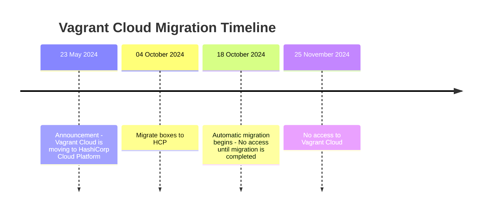

## Steps to migrate

Just follow the Steps,

| Screenshot       |
| ---------------- |
|  |
| 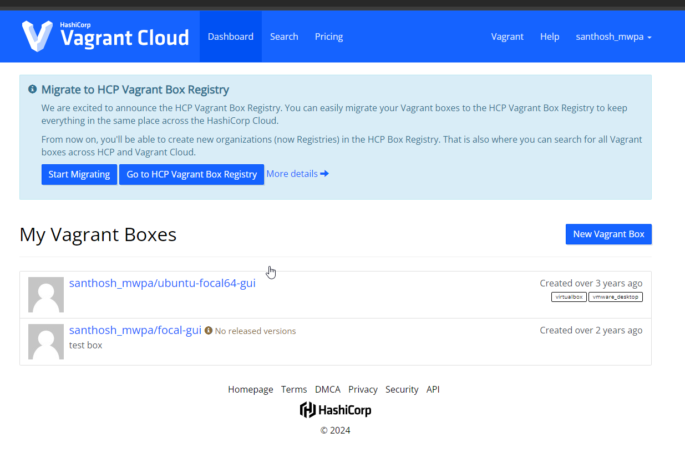 |
| 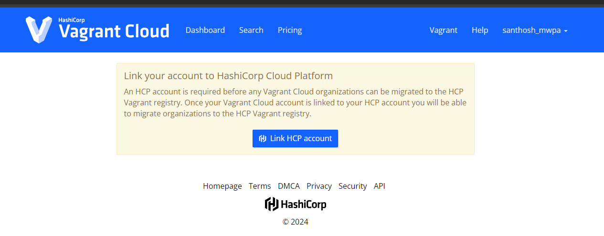 |
|  |
|  |
|  |
|  |
|  |
|  |
| 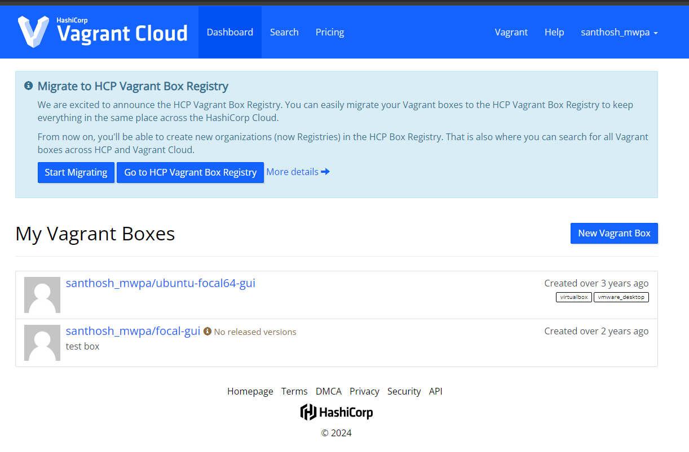 |
| 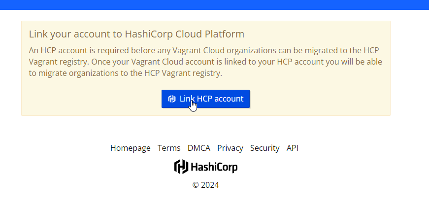 |
|  |
| 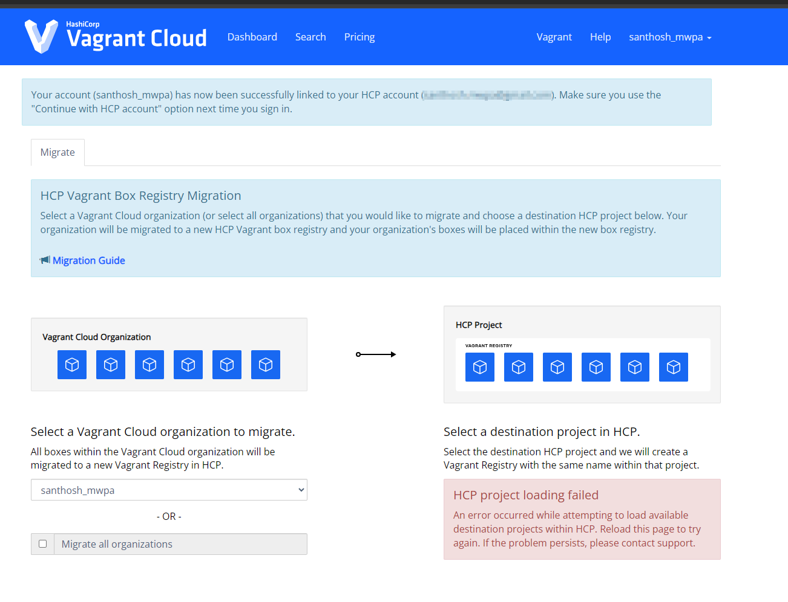 |
| 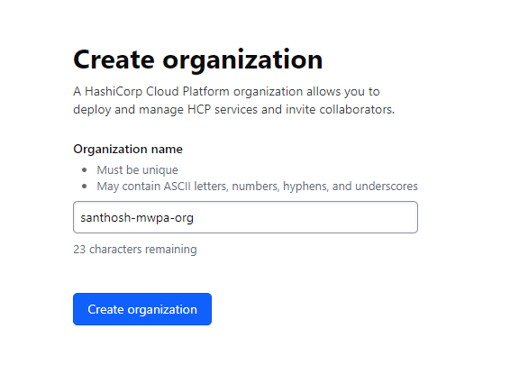 |
| 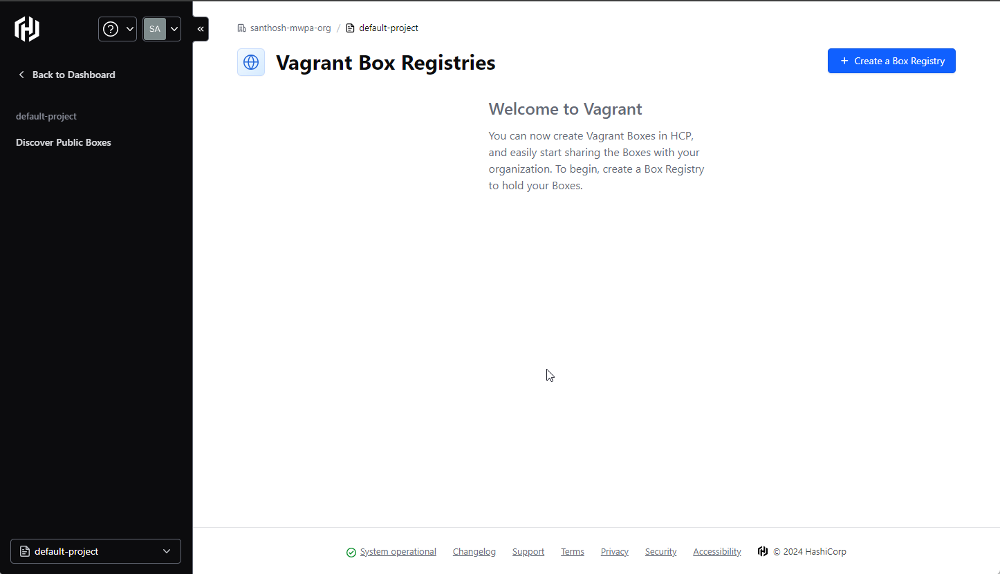 |
|  |
| 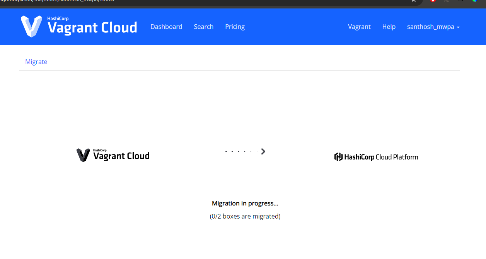 |
| 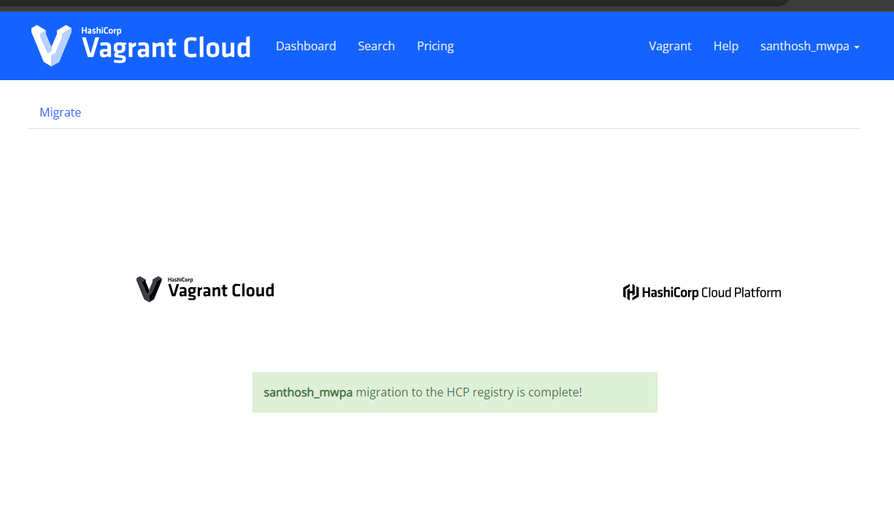 |
| 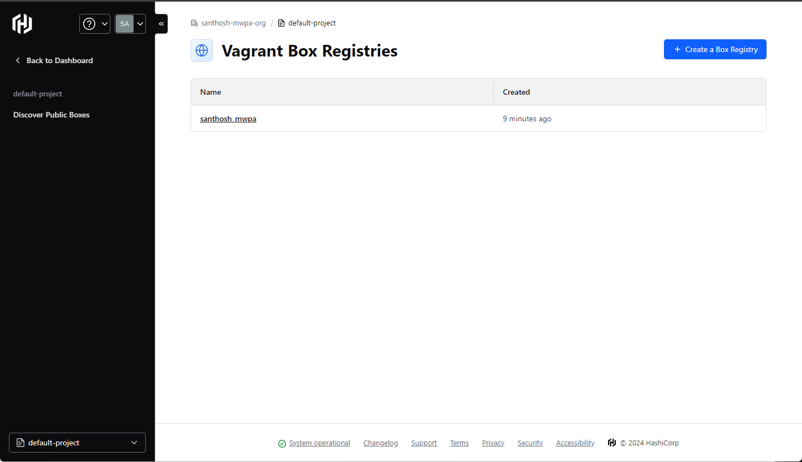 |
| 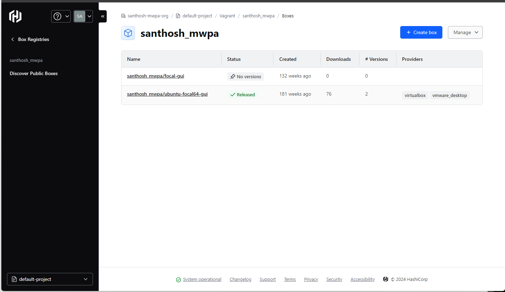 |
| 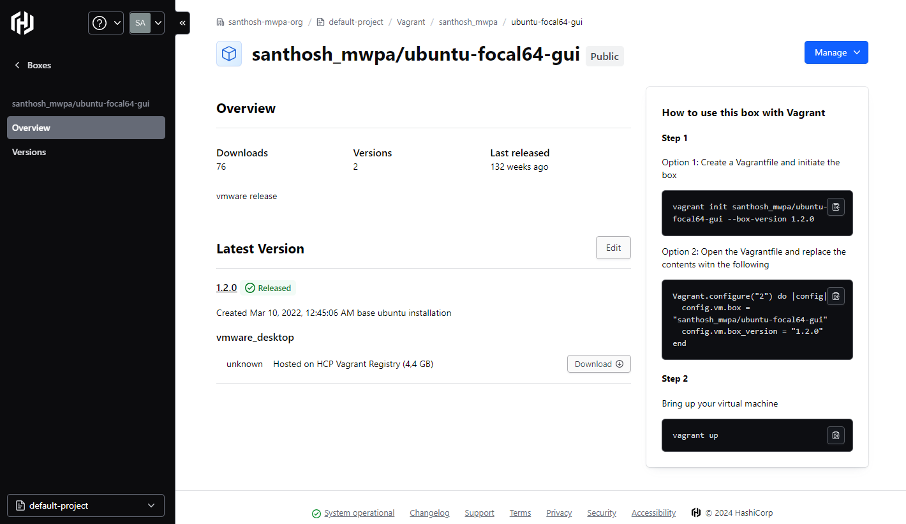 |
