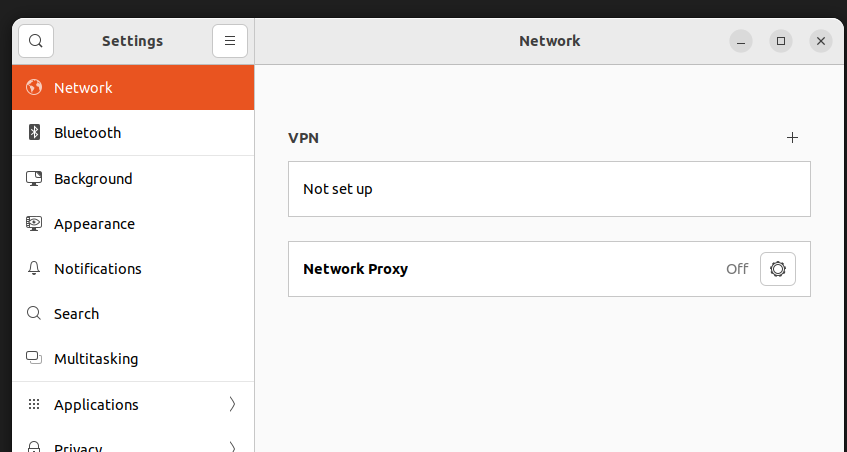
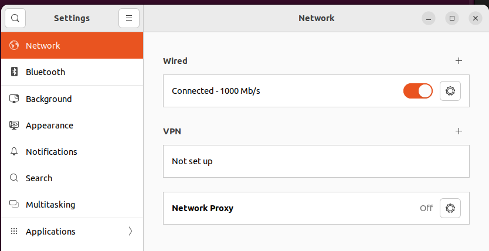

## Problem

Suddenly the network icon disappeared in Ubuntu VM, like below:





## Solution

```sh frame="none"

nmcli network on

```

```sh frame="none"
$ nmcli --help
Usage: nmcli [OPTIONS] OBJECT { COMMAND | help }

OPTIONS
  -a, --ask                                ask for missing parameters
  -c, --colors auto|yes|no                 whether to use colors in output
  -e, --escape yes|no                      escape columns separators in values
  -f, --fields <field,...>|all|common      specify fields to output
  -g, --get-values <field,...>|all|common  shortcut for -m tabular -t -f
  -h, --help                               print this help
  -m, --mode tabular|multiline             output mode
  -o, --overview                           overview mode
  -p, --pretty                             pretty output
  -s, --show-secrets                       allow displaying passwords
  -t, --terse                              terse output
  -v, --version                            show program version
  -w, --wait <seconds>                     set timeout waiting for finishing operations

OBJECT
  g[eneral]       NetworkManager's general status and operations
  n[etworking]    overall networking control
  r[adio]         NetworkManager radio switches
  c[onnection]    NetworkManager's connections
  d[evice]        devices managed by NetworkManager
  a[gent]         NetworkManager secret agent or polkit agent
  m[onitor]       monitor NetworkManager changes

```

### Results




