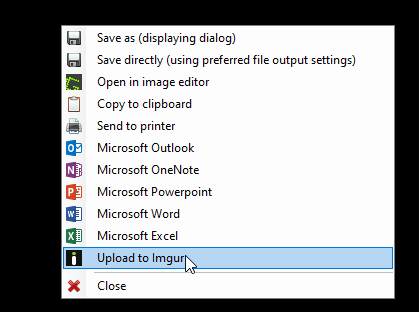
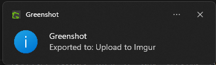
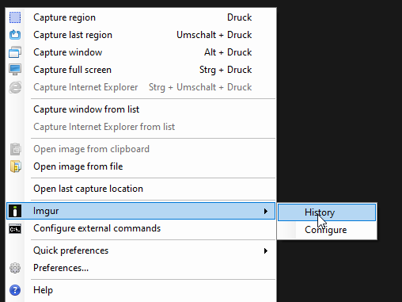
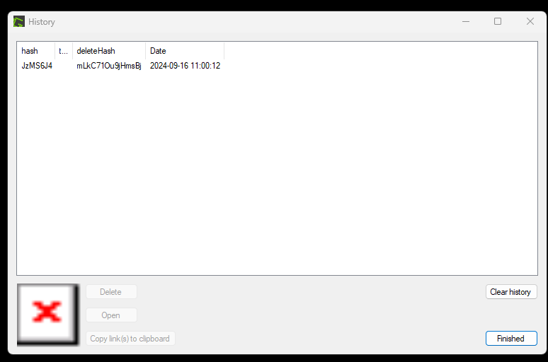
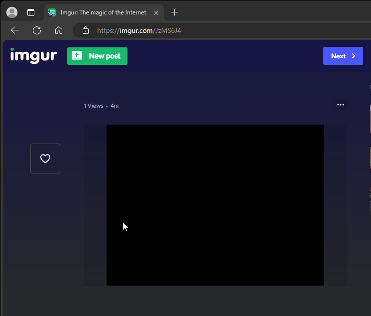
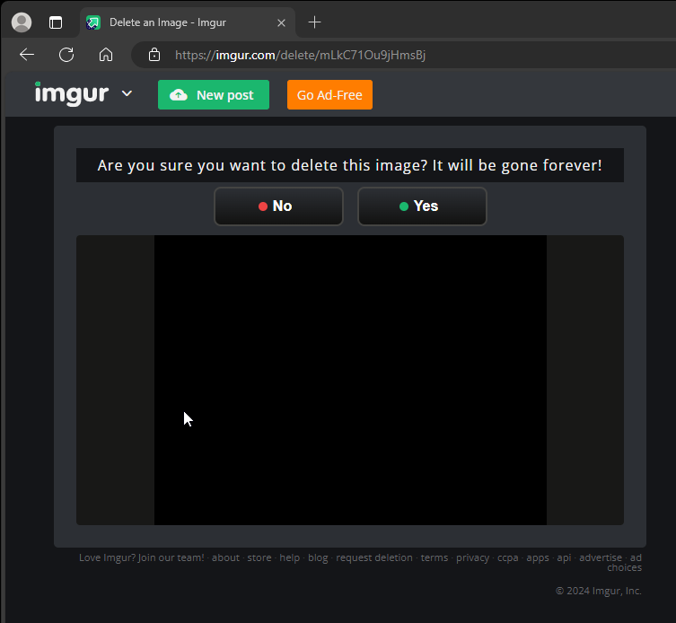
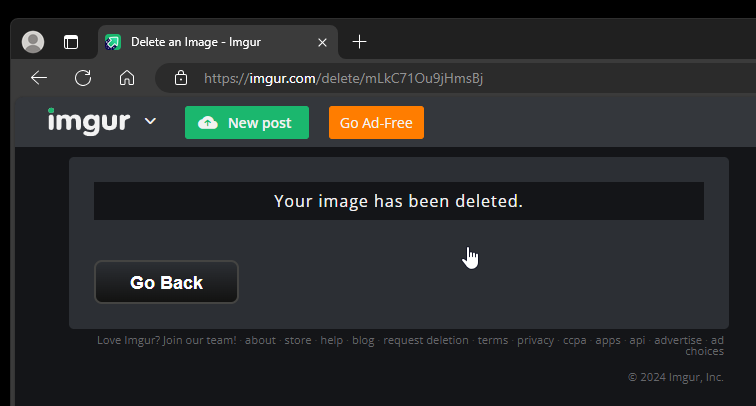
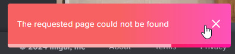

## Introduction

Accidently, uploaded image to the `imgur` website anonymously and wondering how to delete it ?

Below are the steps to delete the file from `imgur` website permanently.

| Action                                                                                                             |               Screenshot                |
| ------------------------------------------------------------------------------------------------------------------ | :-------------------------------------: |
| Accidental upload                                                                                                  |     |
| File uploaded                                                                                                      |         |
| Find the link - open `Imgur > History`                                                                             |          |
| Using `hash` or **Open** button, the image can be viewed <br> link: `https://imgur.com/JzMS6J4`                    |            |
| Open image link.                                                                                                   |             |
| Delete hash (__mLkC71Ou9jHmsBj__) gives the link for permanent deletion `https://imgur.com/delete/mLkC71Ou9jHmsBj` |         |
| Successfull deletion                                                                                               |  |
| Recheck the image link, following toast should be generated                                                        |       |


## Troubleshoot

Somehow, before retrieving the `deleteHash`, if the **Clear history** action is performed, still there is a trick, where we can retrieve the `deleteHash`

- Navigate to `C:\Users\<username>\AppData\Local\Greenshot`
- Open the file **Greenshot.log**
- Search for `hashes`
- and you can find `JzMS6J4` and its delete hash in the same log line 
  
    ```log "JzMS6J4" "mLkC71Ou9jHmsBj"
    --- [GreenshotImgurPlugin.ImgurPlugin] Storing imgur upload for hash JzMS6J4 and delete hash mLkC71Ou9jHmsBj
    ```