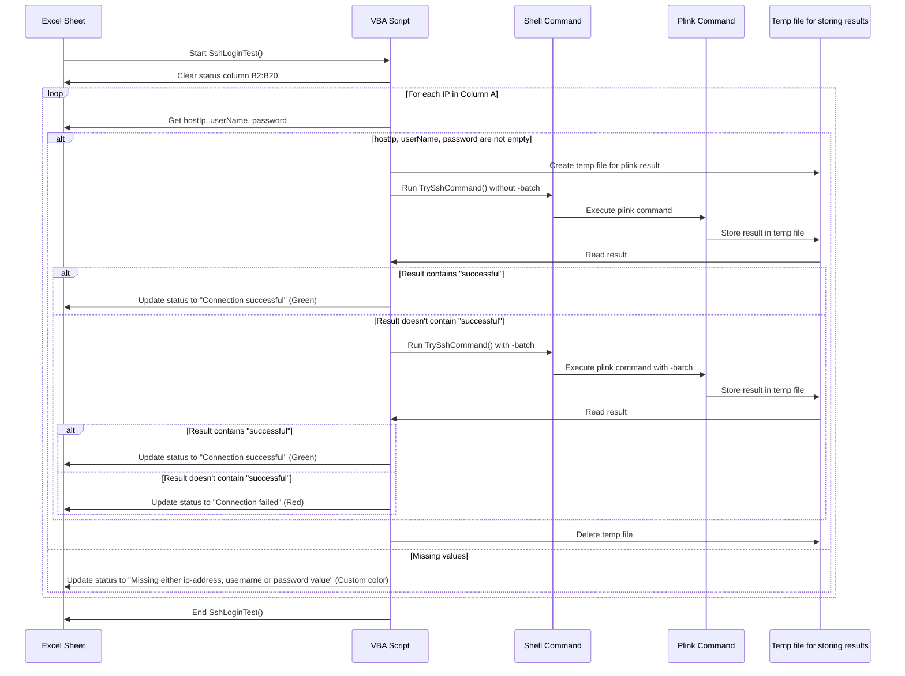

import DownloadItem from "../../../../components/helper/DownloadItem.astro";

## Introduction

A shoutout to one my youtube subscriber which made this **article** possible


:::tip
Jump to complete [here](#complete-code)
:::

## Pre requisites

1. Download `plink` exe
   - From the website: https://www.chiark.greenend.org.uk/~sgtatham/putty/latest.html
   - or to download directly, click [here](https://the.earth.li/~sgtatham/putty/latest/w64/plink.exe)

## Workflow


## Steps to build

### 1. Column definitions

| Column | Description            | Example                |
| :----: | ---------------------- | ---------------------- |
|   A    | Hostname or IP-Address | 192.168.80.142         |
|   B    | Status                 | Connection successfull |
|   C    | Last reachable at      | 29/09/2024 03:00:59 PM |
|   D    | Username               | dev                    |
|   E    | Password               | dev                    |

:::note
Format the Column **E** to mask the password. 

For the press `CTRL+1` or right-click and select `Format cells`.

    `Number` -> `Custom` and enter `;;;**`
:::

### 2. `VBA` code

- Create a sub routine called `SshLoginTest`

    ```vb
    Sub SshLoginTest()

        Dim plinkPath As String, tempFile As String, userName As String, password As String, hostIp As String
        
        'rest of the code

    End Sub
    ```

- Setup the location of the downloaded `plink` 

    ```vb
    'path to plink
    plinkPath = "C:\Temp\plink.exe"

    ```

- Clear the previous results

    ```vb
    'clear the status column
    Range("B2:B20").ClearContents
    ```

- Now loop through the ip-Address

    - Get ip-address, username and password
        ```vb
        'get the ip-address, username, password
        hostIp = Trim(ActiveSheet.Cells(i, 1).Value)
        userName = Trim(ActiveSheet.Cells(i, 4).Value)
        password = Trim(ActiveSheet.Cells(i, 5).Value)
        ```
    
    - Make sure that all three variables are available and are not empty.
        ```vb
        hostIp <> "" And userName <> "" And password <> ""

        else

        'if values are missing in the columns
        ActiveSheet.Cells(i, 2).Value = "Missing either ip-address, username or password value"
        ActiveSheet.Cells(i, 2).Font.Color = RGB(154, 88, 99)
        ```
    
    - Set the `temp` file location
        ```vb
        'temporary file to store plink result
        tempFile = Environ$("TEMP") & "\plink_result_" & hostIp & ".txt"
        ```
    
    - The `command` for the testing the ssh-login
        ```vb
        'command to check for ssh login
        Command = "cmd /c " & plinkPath & " -ssh " & hostIp & " -l " & userName & " -pw " & password & " -batch echo connection successfull exit > " & tempFile
        ```
    
    - Create a shell and execute the command
        ```vb
        'run the command in shell, without window frame
        Set objShell = CreateObject("wscript.shell")
        returnCode = objShell.Run(Command, 0, True)
        
        'wait a bit for the command to complete
        Application.Wait (Now + TimeValue("00:00:02"))
        ```
    
    - Evaluate the result
        ```vb
        'if login successfull, then the "connection successufull" test is checked
        If InStr(result, "successfull") > 0 Then
            ActiveSheet.Cells(i, 2).Value = "Connection successful"
            ActiveSheet.Cells(i, 2).Font.Color = vbGreen
            ActiveSheet.Cells(i, 3).Value = Now
        Else
            ActiveSheet.Cells(i, 2).Value = "Connection failed"
            ActiveSheet.Cells(i, 2).Font.Color = vbRed
        End If
        ```
    - It is possible that the host server is not known to the machine for the first time.

        

        - Verify if the host exists in the `Registry editor` (**regedit**)
            
        
        - To solve this issue, the host needs to be added to the `ssh cache`. Using the following command, without adding the `-batch` flag.
            ```vb
            'command to add host key to cache on first connection attempt
            Command = "cmd /c echo y | " & plinkPath & " -ssh " & hostIp & " -l " & userName & " -pw " & password & " echo connection successful > " & tempFile

            'run the command in shell, without window frame to add host key
            Set objShell = CreateObject("wscript.shell")
            returnCode = objShell.Run(Command, 0, True)
            ```

### 3. Download the SAMPLE file

<DownloadItem title="SshLoginTest.xlsm" icon="/youtube/icon/excel.svg" url="/youtube/resource/ssh_login_test.xlsm"  />

## Complete code

```vb title="SshLoginTest.bas"
Sub SshLoginTest()

    Dim plinkPath As String, tempFile As String, userName As String, password As String, hostIp As String
    Dim objShell As Object, result As String

    'path to plink
    plinkPath = "C:\Temp\plink.exe"

    'initialize shell object
    Set objShell = CreateObject("wscript.shell")

    'clear the status column
    Range("B2:B20").ClearContents

    'loop through the ip-address
    For i = 2 To Cells(Rows.Count, 1).End(xlUp).Row

        'get the ip-address, username, password
        hostIp = Trim(ActiveSheet.Cells(i, 1).Value)
        userName = Trim(ActiveSheet.Cells(i, 4).Value)
        password = Trim(ActiveSheet.Cells(i, 5).Value)

        If hostIp <> "" And userName <> "" And password <> "" Then
            'temporary file to store plink result
            tempFile = Environ$("TEMP") & "\plink_result_" & hostIp & ".txt"
            
            'try connecting and storing host key
            If TrySshCommand(plinkPath, hostIp, userName, password, tempFile, False, objShell) Then
                ActiveSheet.Cells(i, 2).Value = "Connection successful"
                ActiveSheet.Cells(i, 2).Font.Color = vbGreen
                ActiveSheet.Cells(i, 3).Value = Now
            
            'retry using -batch after host key caching
            ElseIf TrySshCommand(plinkPath, hostIp, userName, password, tempFile, True, objShell) Then
                ActiveSheet.Cells(i, 2).Value = "Connection successful"
                ActiveSheet.Cells(i, 2).Font.Color = vbGreen
                ActiveSheet.Cells(i, 3).Value = Now
            Else
                ActiveSheet.Cells(i, 2).Value = "Connection failed"
                ActiveSheet.Cells(i, 2).Font.Color = vbRed
            End If
        Else
            'if values are missing in the columns
            ActiveSheet.Cells(i, 2).Value = "Missing either ip-address, username or password value"
            ActiveSheet.Cells(i, 2).Font.Color = RGB(154, 88, 99)
        End If

        ' Clean up the temp file
        On Error Resume Next
        Kill tempFile
        On Error GoTo 0

    Next

End Sub

Function TrySshCommand(plinkPath As String, hostIp As String, userName As String, password As String, tempFile As String, useBatch As Boolean, objShell As Object) As Boolean
    Dim Command As String, result As String, returnCode As Long
    
    If useBatch Then
        'Command to check for SSH login with -batch
        Command = "cmd /c " & plinkPath & " -ssh " & hostIp & " -l " & userName & " -pw " & password & " -batch echo connection successful > " & tempFile
    Else
        'Command to add host key to cache on first connection attempt
        Command = "cmd /c echo y | " & plinkPath & " -ssh " & hostIp & " -l " & userName & " -pw " & password & " echo connection successful > " & tempFile
    End If

    'run the command in shell, without window frame
    returnCode = objShell.Run(Command, 0, True)
    
    'wait a bit for the command to complete
    Application.Wait (Now + TimeValue("00:00:02"))

    'read the result from the temporary file
    On Error Resume Next
    result = CreateObject("Scripting.FileSystemObject").OpenTextFile(tempFile, 1).ReadAll
    On Error GoTo 0

    'check if login was successful
    TrySshCommand = (InStr(result, "successful") > 0)

End Function


```
