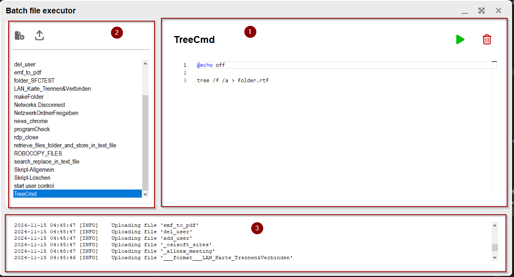
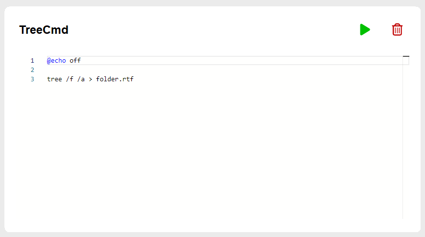
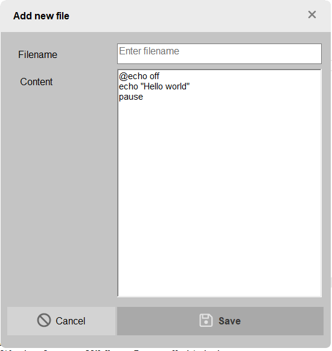
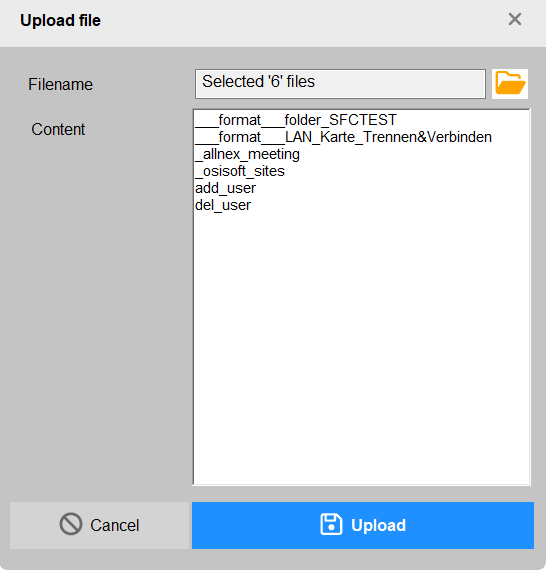
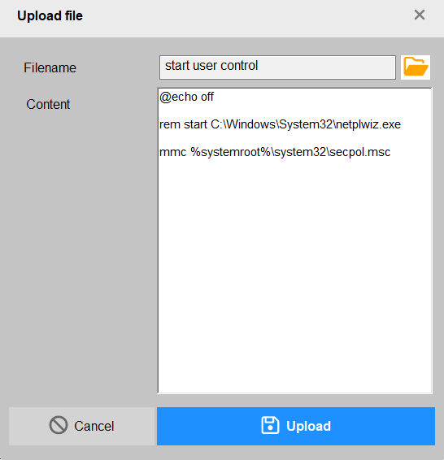
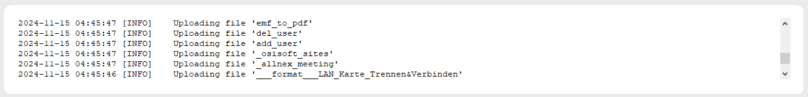
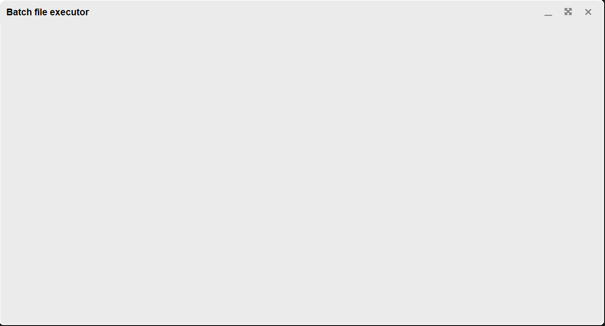
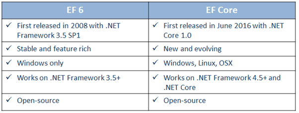
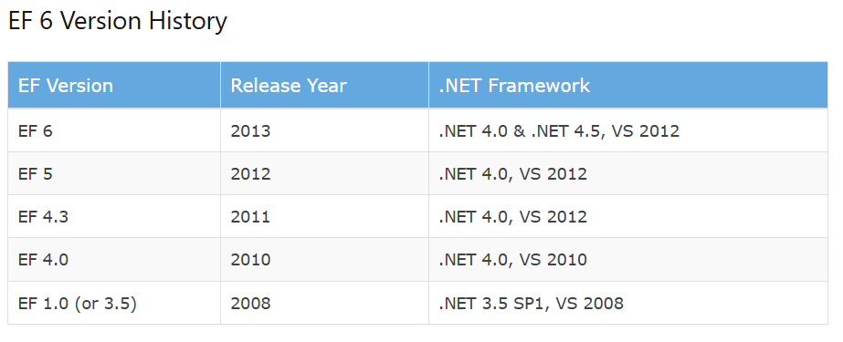
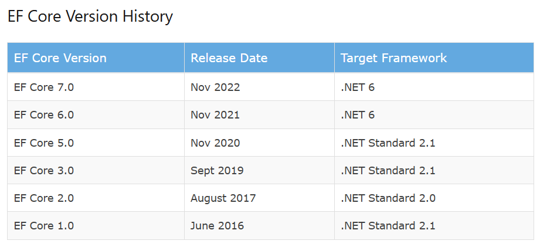

import { FileTree, Tabs, TabItem, Steps } from '@astrojs/starlight/components';
import MyLink from "../../../../components/MyLink.astro";

<MyLink iconName="github" header="GitHub" description="Link to repo" link={"https://github.com/santhosh2r2/batch-file-executor"}/>

###### Below is the project solution structure

<FileTree  >
- .gitattributes
- .gitignore
- .gitlab-ci.yml
- Batch.File.Executor.sln
- Batch.File.Executor.sln.DotSettings.user
- LICENSE.txt
- README.md
- Batch.File.Executor               # WinForms project
	-   Batch.File.Executor.csproj
	-   Batch.File.Executor.csproj.user
	-   editor.html
	-   MainForm.cs
        -   MainForm.Designer.cs
        -   MainForm.resx
	-   NLog.config
	-   **Program.cs**
	- Controllers
		- AppControllerBase.cs
		- BatchFileAppController.cs
		- ExecuteFileController.cs
		- LogController.cs
    - Lib
	- Monaco
		- ...                       # library comes here
    - Models
        - Datamodel.cs
    - Properties
        - PublishProfiles
            - FolderProfile.pubxml
            - FolderProfile.pubxml.user
    - Resources
    - $this.Icon.ico
    - Service
        - AppLogger.cs
    - UserControls
        - MainView.cs
            - MainView.Designer.cs
            - MainView.resx
    - Views
        - DialogBase.cs
            - DialogBase.Designer.cs
            - DialogBase.resx
        - DialogNewFile.cs
            - DialogNewFile.Designer.cs
            - DialogNewFile.resx
        - DialogUpload.cs
            - DialogUpload.Designer.cs
            - DialogUpload.resx
- Unit.Tests                        # Tests
    - Database_Reset.cs
    - NLog.config
    - Test_EF_Database.cs
    - Test_Execution.cs
    - Test_NLog.cs
    - Unit.Tests.csproj
	- Models
		- Datamodel.cs
            
</FileTree>


## Application setup

- Create a Windows Forms C# project in visual studio
- Create also a Unit Test project

### Nuget Packages

- Packages for `Windows Forms C#` project

    - FontAwesome.Sharp (6.6.0)
    - Microsoft.EntityFrameworkCore (8.0.8) 
    - Microsoft.EntityFrameworkCore.Sqlite (8.0.8) 
    - Microsoft.EntityFrameworkCore.Tools (8.0.8) 
    - Microsoft.Web.WebView2 (1.0.2739.15)
    - NLog (5.3.3)
    - NLog.Databases (5.3.3)
    - NLog.Extensions.Logging (5.3.12)
    - System.Data.SQLite (1.0.118)

- Packages for `Unit Test` project

    - coverlet.collector (6.0.2) 
    - Microsoft.EntityFrameworkCore (8.0.8) 
    - Microsoft.EntityFrameworkCore.InMemory (8.0.8) 
    - Microsoft.EntityFrameworkCore.Tools (8.0.8) 
    - Microsoft.Web.WebView2 (1.0.2739.15)
    - NLog (5.3.3)
    - NLog.Databases (5.3.3)
    - NLog.Extensions.Logging (5.3.12)
    - System.Data.SQLite (1.0.118)
    - xunit (2.9.0)
    - xunit.runner.visualstudio (2.8.2)

### Log configuration

In this project, the logging of system and user actions are saved to `SQLite` database and alternatively as files. To achieve this, we will be using `NLog` framework.

- NLog internal configuration - for the logging framework itself
    - `internalLogLevel` - level of logging required for viewing
    - `internalLogFile` - location of the `NLog` Logging

- `Targets` in NLog define where the logs are to be sent. This could be console, file or even database. For this project, we are going to save the logs in file (maximum 4 files) and to SQLite database itself

    - For the file target, `layout` attribute defines how each line is formatted.
    - For the database target, `commandText` element defines how each entry is saved to the database. `parameter` are defined in the command text, which then can have an element describing the `layout`

- `Rules` define which logger is allowed to write to the target. Logging granularity can be set with the attribute `minlevel`

Refer the entire configuration of the `NLog` below.

```xml title="NLog.config"
<?xml version="1.0" encoding="utf-8" ?>
<nlog xmlns="http://www.nlog-project.org/schemas/NLog.xsd" 
      xmlns:xsi="http://www.w3.org/2001/XMLSchema-instance"
	internalLogLevel="Debug"
	internalLogFile="c:\temp\nlog-internal.txt"
	internalLogToConsole="true"
	throwConfigExceptions="true"
	>
	<targets>
		<target name="file" xsi:type="File"
		        layout="${longdate} | ${logger} | ${level:uppercase=true} | ${event-properties:item=batchFileId} | ${message}${exception:format=ToString}"
		        fileName="C:/Temp/logs/AppLog.${shortdate}.txt"
		        maxArchiveFiles="4"
		        archiveAboveSize="10240" />

		<target xsi:type="Database" name="database">
			<dbProvider>System.Data.SQLite.SQLiteConnection, System.Data.SQLite</dbProvider>
			<connectionString>Data Source=batchfileexecutor.db;Version=3;</connectionString>
			<commandType>Text</commandType>
			<commandText>
				INSERT INTO Log
				(LogDate, Level, BatchFileId, Message)
				VALUES
				(@logdate, @level, @batchfileid, @message)
			</commandText>

			<parameter name="@logdate" layout="${longdate:universalTime=true}" />
			<parameter name="@level" layout="${level:uppercase=true}" />
			<parameter name="@batchfileid" layout="${event-properties:item=BatchFileId}" />
			<parameter name="@message" layout="${message}" />

		</target>

	</targets>

	<rules>
		<logger name="*" minlevel="Trace" writeTo="database" />
		<logger name="*" minlevel="Trace" writeTo="file" />
	</rules>
</nlog>
```

## Important code snippets

```c# title="file: Datamodel.cs"
using System.ComponentModel.DataAnnotations.Schema;
using Microsoft.EntityFrameworkCore;

namespace Batch.File.Executor.Models;

[Table("BatchFile")]
public class BatchFile
{
    public int Id { get; set; }
    public string display_name { get; set; }
    public DateTime created_at { get; set; }
    public DateTime? last_modified_at { get; set; }
    public string text { get; set; }
    public DateTime? last_executed_at { get; set; }
    public string? comment { get; set; }

    public ICollection<ExecutionLog> ExecutionLogs { get; set; } = new List<ExecutionLog>();
    public ICollection<Log> Logs { get; set; } = new List<Log>();
}

[Table("ExecutionLog")]
public class ExecutionLog
{
    public int Id { get; set; }
    public DateTime time_start { get; set; }
    public DateTime time_end { get; set; }
    public int BatchFileId { get; set; }
    public BatchFile BatchFile { get; set; }

    public override string ToString() => $"Execution ID ({Id}): {time_start} - {time_end}";
}
[Table("Log")]
public class Log
{
    public int Id { get; set; }
    public DateTime LogDate { get; set; }
    public string Level { get; set; }
    public string Message { get; set; }
    public int BatchFileId { get; set; }
    public BatchFile BatchFile { get; set; }
}

public class LogItem(Log log)
{
    public Log Log => log;
    public string FullMessasge => $"{Log.LogDate.ToLocalTime():yyyy-MM-dd HH:mm:ss} [{Log.Level}]    {Log.Message}";
    public int Id => Log.Id;
}

public class BatchFileExecutorContext : DbContext
{
    public BatchFileExecutorContext() { }
    public BatchFileExecutorContext(DbContextOptions<BatchFileExecutorContext> options) : base(options) { }

    // Entities
    public DbSet<BatchFile> BatchFiles { get; set; }
    public DbSet<ExecutionLog> ExecutionLogs { get; set; }
    public DbSet<Log> Logs { get; set; }

    // Connection Builder
    protected override void OnConfiguring(DbContextOptionsBuilder? optionsBuilder)
    {
        if (optionsBuilder is { IsConfigured: false })
        {
            optionsBuilder.UseSqlite(@"Data Source=batchfileexecutor.db");
        }
    }
}
```

```c# title="file: Service\AppLogger.cs"
using NLog;

namespace Batch.File.Executor.Service;

public class AppLogger
{
    private static readonly Logger Logger = LogManager.GetCurrentClassLogger();

    public void Write(LogLevel logLevel, int batchFileId, string message)
    {
        var logEventInfo = new LogEventInfo(logLevel, Logger.Name, message)
        {
            Properties =
            {
                ["BatchFileId"] = batchFileId,
            }
        };

        Logger.Log(logEventInfo);
    }
}
```


## UI development


<Steps>
1. `MainView` - consist of the batch file along with start and delete buttons
2. `Sidebar` - actions for create and uploading files, lists available batch files for ExecuteFileController
3. `Logger` - displays the user and system action
</Steps>

### Mainview

The main view consists of filename, start button and delete button.



Check the tabs for the integration of `Monaco` editor which powers the VSCode.

<Tabs>
<TabItem label="Part of the Editor" icon='seti:c-sharp'>

```c#
    #region Monaco Editor

    // Method to set content dynamically in the Monaco Editor
    private async void SetEditorContent(string content)
    {
        // Execute JavaScript in the WebView2 to update the editor content
        var script = $"setEditorContent({EscapeJavaScriptString(content)});";
        if (webView21.CoreWebView2 != null) await webView21.ExecuteScriptAsync(script);
    }

    // Utility method to escape JavaScript strings to prevent errors
    private static string EscapeJavaScriptString(string s)
    {
        return "\"" + s.Replace("\\", "\\\\").Replace("\"", "\\\"").Replace("\n", "\\n").Replace("\r", "\\r") + "\"";
    }


    private async void InitializeWebView2Async()
    {
        // Ensure WebView2 is ready before loading the content
        await webView21.EnsureCoreWebView2Async(null);

        // Get the path of the HTML file containing the Monaco Editor
        var currentDirectory = Directory.GetCurrentDirectory();
        var editorHtmlPath = Path.Combine(currentDirectory, "editor.html");

        // Load the editor.html file into the WebView2
        webView21.Source = new Uri(editorHtmlPath);

    }
    #endregion
```
</TabItem>

<TabItem label="editor.html" icon="seti:html">
```html
<!DOCTYPE html>
<html lang="en">
<head>
    <meta charset="UTF-8">
    <meta name="viewport" content="width=device-width, initial-scale=1.0">
    <title>Monaco Editor</title>
    <style>
        body, html {
            margin: 0;
            padding: 0;
            width: 100%;
            height: 100%;
            overflow: hidden;
        }

        #container {
            width: 100%;
            height: 100vh;
        }
    </style>
    <script src="Lib/Monaco/min/vs/loader.js"></script>
</head>
<body>
    <div id="container"></div>
    <script>

        let editor; // Declare the editor variable globally

        // Configure the path to the local Monaco Editor files
        require.config({
            paths: {
                'vs': 'Lib/Monaco/min/vs'
            }
        });
        require(['vs/editor/editor.main'], function () {
            editor = monaco.editor.create(document.getElementById('container'), {
                value: [
                    'loading...',
                ].join('\n'),
                language: 'bat', // Set language to Batch script
                minimap: { enabled: false }, // Hide the mini-map
                theme: 'vs-light', // vs-dark
                automaticLayout: true,  
                wordWrap: "on",
            });
        });

        // Function to set content dynamically from C#
        function setEditorContent(content) {
            if (editor) {
                editor.setValue(content);
            } else {
                console.error("Editor is not initialized.");
            }
        }
        // Function to get the content of the Monaco Editor
        function getEditorContent() {
            return editor ? editor.getValue() : '';
        }
    </script>
</body>
</html>

```
</TabItem>

<TabItem label="Implementation in mainview.cs">
```c#
#region Monaco Editor

// Method to set content dynamically in the Monaco Editor
private async void SetEditorContent(string content)
{
    // Execute JavaScript in the WebView2 to update the editor content
    var script = $"setEditorContent({EscapeJavaScriptString(content)});";
    if (webView21.CoreWebView2 != null) await webView21.ExecuteScriptAsync(script);
}

// Utility method to escape JavaScript strings to prevent errors
private static string EscapeJavaScriptString(string s)
{
    return "\"" + s.Replace("\\", "\\\\").Replace("\"", "\\\"").Replace("\n", "\\n").Replace("\r", "\\r") + "\"";
}


private async void InitializeWebView2Async()
{
    // Ensure WebView2 is ready before loading the content
    await webView21.EnsureCoreWebView2Async(null);

    // Get the path of the HTML file containing the Monaco Editor
    var currentDirectory = Directory.GetCurrentDirectory();
    var editorHtmlPath = Path.Combine(currentDirectory, "editor.html");

    // Load the editor.html file into the WebView2
    webView21.Source = new Uri(editorHtmlPath);

}
#endregion
```
</TabItem>
</Tabs>

### DialogNewFile



### DialogUpload

- Upload multiple files



- Upload single file



### LoggerView



### UI - titbits

Below I will show you essential code bits required to reproduce the Modern UI in Windows Forms.

#### Modern UI



In the `MainForm.cs` file, 

```c# title="Initialize private variables and function"
    private int borderRadius = 10;
    private int borderSize = 2;
    private Color borderColor = Color.White;
    private Color titlebarColor = Color.FromArgb(235, 235, 235);
    private Color containerColor = Color.FromArgb(235, 235, 235);

    void SetIconColors(Button control, Color color)
    {
        control.BackColor = color;
        control.FlatAppearance.BorderColor = color;
    }

```

```c# title="Main UI - border"

#region curved border mainform and ui components
//Drag Form
[DllImport("user32.DLL", EntryPoint = "ReleaseCapture")]
private extern static void ReleaseCapture();
[DllImport("user32.DLL", EntryPoint = "SendMessage")]
private extern static void SendMessage(System.IntPtr hWnd, int wMsg, int wParam, int lParam);

protected override CreateParams CreateParams
{
    get
    {
        CreateParams cp = base.CreateParams;
        cp.Style |= 0x20000; // <--- Minimize borderless form from taskbar
        return cp;
    }
}

// Private methods
private GraphicsPath GetRoundedPath(Rectangle rect, float radius)
{
    GraphicsPath path = new GraphicsPath();
    float curveSize = radius * 2F;

    path.StartFigure();
    path.AddArc(rect.X, rect.Y, curveSize, curveSize, 180, 90);
    path.AddArc(rect.Right - curveSize, rect.Y, curveSize, curveSize, 270, 90);
    path.AddArc(rect.Right - curveSize, rect.Bottom - curveSize, curveSize, curveSize, 0, 90);
    path.AddArc(rect.X, rect.Bottom - curveSize, curveSize, curveSize, 90, 90);
    path.CloseFigure();
    return path;
}

private void FormRegionAndBorder(Form form, float radius, Graphics graph, Color borderColor, float borderSize)
{
    if (this.WindowState != FormWindowState.Minimized)
    {
        using (GraphicsPath roundPath = GetRoundedPath(form.ClientRectangle, radius))
        using (Pen penBorder = new Pen(borderColor, borderSize))
        using (Matrix transform = new Matrix())
        {
            graph.SmoothingMode = SmoothingMode.AntiAlias;
            form.Region = new Region(roundPath);
            if (borderSize >= 1)
            {
                Rectangle rect = form.ClientRectangle;
                float scaleX = 1.0F - ((borderSize + 1) / rect.Width);
                float scaleY = 1.0F - ((borderSize + 1) / rect.Height);

                transform.Scale(scaleX, scaleY);
                transform.Translate(borderSize / 1.6F, borderSize / 1.6F);

                graph.Transform = transform;
                graph.DrawPath(penBorder, roundPath);
            }
        }
    }
}

private void ControlRegionAndBorder(Control control, float radius, Graphics graph, Color borderColor)
{
    using GraphicsPath roundPath = GetRoundedPath(control.ClientRectangle, radius);
    using Pen penBorder = new(borderColor, 1);
    graph.SmoothingMode = SmoothingMode.AntiAlias;
    control.Region = new Region(roundPath);
    graph.DrawPath(penBorder, roundPath);
}

private void MainForm_Paint(object sender, PaintEventArgs e)
{
    FormRegionAndBorder(this, borderRadius, e.Graphics, borderColor, borderSize);
}


private void MainForm_ResizeEnd(object sender, EventArgs e)
{
    this.Invalidate();
}

private void MainForm_SizeChanged(object sender, EventArgs e)
{
    this.Invalidate();
}

private void MainForm_Activated(object sender, EventArgs e)
{
    this.Invalidate();
}

// Drag and drop the titlebar
private void panelTitleBar_MouseDown(object sender, MouseEventArgs e)
{
    ReleaseCapture();
    SendMessage(this.Handle, 0x112, 0xf012, 0);
}

private void MainForm_Resize(object sender, EventArgs e)
{
    this.Invalidate();
    panelContainer.Invalidate();
    panelSidebar.Invalidate();
    panelMainView.Invalidate();
}

// Function which actually modifies the UI
private void panelContainer_Paint(object sender, PaintEventArgs e)
{
    ControlRegionAndBorder(panelContainer, borderRadius - (borderSize / 2), e.Graphics, borderColor);
}

#endregion
```

Apply this for the rest of the containers - `panelLogs` `panelSidebar` and `panelMainView`

```c#
private void panelSidebar_Paint(object sender, PaintEventArgs e)
{
    ControlRegionAndBorder(panelSidebar, 10, e.Graphics, borderColor);
}

private void panelLogs_Paint(object sender, PaintEventArgs e)
{
    ControlRegionAndBorder(panelLogs, 10, e.Graphics, borderColor);
}

private void panelMainView_Paint(object sender, PaintEventArgs e)
{
    ControlRegionAndBorder(panelMainView, 10, e.Graphics, borderColor);
}
```

#### App - Windows buttons


```c# title="Functions for 'Window buttons'"

// Enum
enum ScreenSizeMode
{
    WithTaskbar,
    FullScreen,
    Normal,
    Minimized
}

private ScreenSizeMode _screenSize = ScreenSizeMode.Normal;

// Function for the `middle` button
private void btnMaximize_Click_1(object sender, EventArgs e)
{
    switch (_screenSize)
    {
        case ScreenSizeMode.Normal:
            {
                _screenSize = ScreenSizeMode.WithTaskbar;
                if (Screen.PrimaryScreen != null) this.MaximumSize = Screen.PrimaryScreen.WorkingArea.Size;
                WindowState = FormWindowState.Maximized;
                btnMaximize.IconChar = IconChar.Expand;
                break;
            }
        case ScreenSizeMode.WithTaskbar:
            {
                WindowState = FormWindowState.Normal;
                if (Screen.PrimaryScreen != null) this.MaximumSize = Screen.PrimaryScreen.Bounds.Size;
                WindowState = FormWindowState.Maximized;
                _screenSize = ScreenSizeMode.FullScreen;
                btnMaximize.IconChar = IconChar.Compress;
                break;
            }
        default:
            WindowState = FormWindowState.Normal;
            _screenSize = ScreenSizeMode.Normal;
            btnMaximize.IconChar = IconChar.Maximize;
            this.Size = new Size(1280, 720);
            break;
    }
}

// Function for `minimize` button
private void btnMinimize_Click(object sender, EventArgs e)
{
    WindowState = FormWindowState.Minimized;
    _screenSize = ScreenSizeMode.Minimized;
}

// Function for `close` button
private void btnClose_Click(object sender, EventArgs e)
{
    Application.Exit();
}
```

## Entity framework ([source](https://www.entityframeworktutorial.net/entityframework6/what-is-entityframework.aspx))

**What is Entity Framework?**

<details>
<summary>
**TLDR;**
It is a framework to interact with the database within the C# Project.
</summary>

Prior to .NET 3.5, we (developers) often used to write ADO.NET code or Enterprise Data Access Block to save or retrieve application data from the underlying database. We used to open a connection to the database, create a DataSet to fetch or submit the data to the database, convert data from the DataSet to .NET objects or vice-versa to apply business rules. This was a cumbersome and error prone process. Microsoft has provided a framework called "Entity Framework" to automate all these database related activities for your application.

Entity Framework is an open-source ORM framework for .NET applications supported by Microsoft. It enables developers to work with data using objects of domain specific classes without focusing on the underlying database tables and columns where this data is stored. With the Entity Framework, developers can work at a higher level of abstraction when they deal with data, and can create and maintain data-oriented applications with less code compared with traditional applications.

Official Definition: "Entity Framework is an object-relational mapper (O/RM) that enables .NET developers to work with a database using .NET objects. It eliminates the need for most of the data-access code that developers usually need to write."

The following figure illustrates where the Entity Framework fits into your application.


As per the above figure, Entity Framework fits between the business entities (domain classes) and the database. It saves data stored in the properties of business entities and also retrieves data from the database and converts it to business entities objects automatically.

### Entity Framework Features
- **Cross-platform**: EF Core is a cross-platform framework which can run on Windows, Linux and Mac.
- **Modelling**: EF (Entity Framework) creates an EDM (Entity Data Model) based on POCO (Plain Old CLR Object) entities with get/set properties of different data types. It uses this model when querying or saving entity data to the underlying database.
- **Querying**: EF allows us to use LINQ queries (C#/VB.NET) to retrieve data from the underlying database. The database provider will translate this LINQ queries to the database-specific query language (e.g. SQL for a relational database). EF also allows us to execute raw SQL queries directly to the database.
- **Change** Tracking: EF keeps track of changes occurred to instances of your entities (Property values) which need to be submitted to the database.
- **Saving**: EF executes INSERT, UPDATE, and DELETE commands to the database based on the changes occurred to your entities when you call the SaveChanges() method. EF also provides the asynchronous SaveChangesAsync() method.
- **Concurrency**: EF uses Optimistic Concurrency by default to protect overwriting changes made by another user since data was fetched from the database.
- **Transactions**: EF performs automatic transaction management while querying or saving data. It also provides options to customize transaction management.
- **Caching**: EF includes first level of caching out of the box. So, repeated querying will return data from the cache instead of hitting the database.
- **Built-in Conventions**: EF follows conventions over the configuration programming pattern, and includes a set of default rules which automatically configure the EF model.
- **Configurations**: EF allows us to configure the EF model by using data annotation attributes or Fluent API to override default conventions.
- **Migrations**: EF provides a set of migration commands that can be executed on the NuGet Package Manager Console or the Command Line Interface to create or manage underlying database Schema.

### EF Versions and overview





</details>

### Implementation in project

For a basic implementation, we need a `class` for an entity and a `DbContext` to map the entity to the table

```c#
using System.ComponentModel.DataAnnotations.Schema;
using Microsoft.EntityFrameworkCore;

namespace Batch.File.Executor.Models;

// Entity class
[Table("ExecutionLog")]
public class ExecutionLog
{
    public int Id { get; set; }
    public DateTime time_start { get; set; }
    public DateTime time_end { get; set; }
    public int BatchFileId { get; set; }
    public BatchFile BatchFile { get; set; }

    public override string ToString() => $"Execution ID ({Id}): {time_start} - {time_end}";
}

[Table("Log")]
public class Log
{
    public int Id { get; set; }
    public DateTime LogDate { get; set; }
    public string Level { get; set; }
    public string Message { get; set; }
    public int BatchFileId { get; set; }
    public BatchFile BatchFile { get; set; }
}

[Table("BatchFile")]
public class BatchFile
{
    public int Id { get; set; }
    public string display_name { get; set; }
    public DateTime created_at { get; set; }
    public DateTime? last_modified_at { get; set; }
    public string text { get; set; }
    public DateTime? last_executed_at { get; set; }
    public string? comment { get; set; }

    // maps the execution log entries to this particular batch file
    public ICollection<ExecutionLog> ExecutionLogs { get; set; } = new List<ExecutionLog>();
    
    // maps the log entries to this particular batch file
    public ICollection<Log> Logs { get; set; } = new List<Log>();
}

// DbContext implementation
public class BatchFileExecutorContext : DbContext
{
    public BatchFileExecutorContext() { }
    public BatchFileExecutorContext(DbContextOptions<BatchFileExecutorContext> options) : base(options) { }

    // Entities
    public DbSet<BatchFile> BatchFiles { get; set; }

    // Connection Builder
    protected override void OnConfiguring(DbContextOptionsBuilder? optionsBuilder)
    {
        if (optionsBuilder is { IsConfigured: false })
        {
            optionsBuilder.UseSqlite(@"Data Source=batchfileexecutor.db");
        }
    }
}
```

<Steps>
1. Create and dispose context
    ```c#
    // Create a context
    var context = new BatchFileExecutorContext();

    // Create database, if it does not exist.
    // If database exists, then this function does have any influence.
    context.Database.EnsureCreated();

    // To delete database. WARNING: this will delete the data.
    context.Database.EnsureDeleted();

    // Remember to dispose the context after usage.
    context.Dispose();
    ```
2. Add and update an Entity - BatchFile
    ```c#
    var batchFile = new BatchFile
    {
        display_name = $"Batch file {_context.BatchFiles.ToList().Count + 1}",
        created_at = DateTime.UtcNow,
        text = "@echo off \n 'Hello world'"
    };

    context.BatchFiles.Add(batchFile);
    context.SaveChanges();
    ```
</Steps>

## Testing project - `Unit.Tests`

With unit-tests, each line of production code is tested. Atleast that is the idea for it.

### `xUnit` [homepage](https://xunit.net/)

> xUnit.net is a free, open source, community-focused unit testing tool for the .NET Framework. Written by the original inventor of NUnit v2, xUnit.net is the latest technology for unit testing C#, F#, VB.NET and other .NET languages. xUnit.net works with ReSharper/Rider, CodeRush, TestDriven.NET and Xamarin. It is part of the .NET Foundation, and operates under their code of conduct. It is licensed under Apache 2 (an OSI approved license).

I used `xUnit` testing framework. It is simple yet powerful to use features made easy it.

3 Basic blocks of each test. 

1. `Arrange` - Setup the environment and conditions for the test. Eg. mock values, demo data and so on.
2. `Act` - Here the actual code for testing
3. `Assert` - Check if the desired condition is reached


#### Data models for testing

```c#
using System.ComponentModel.DataAnnotations.Schema;
using Microsoft.EntityFrameworkCore;

namespace Unit.Tests.Models;

[Table("BatchFile")]
public class BatchFile
{
    public int Id { get; set; }
    public string display_name { get; set; }
    public DateTime created_at { get; set; }
    public DateTime? last_modified_at { get; set; }
    public string text { get; set; }
    public DateTime? last_executed_at { get; set; }
    public string? comment { get; set; }

    public ICollection<ExecutionLog> ExecutionLogs { get; set; } = new List<ExecutionLog>();
    public ICollection<Log> Logs { get; set; } = new List<Log>();
}

[Table("ExecutionLog")]
public class ExecutionLog
{
    public int Id { get; set; }
    public DateTime time_start { get; set; }
    public DateTime time_end { get; set; }
    public int BatchFileId { get; set; }
    public BatchFile BatchFile { get; set; }

    public override string ToString() => $"Execution ID ({Id}): {time_start} - {time_end}";
}
[Table("Log")]
public class Log
{
    public int Id { get; set; }
    public DateTime LogDate { get; set; }
    public string Level { get; set; }
    public string Message { get; set; }
    public int BatchFileId { get; set; }
    public BatchFile BatchFile { get; set; }
}

public class BatchFileExecutorContext : DbContext
{
    public BatchFileExecutorContext() { }
    public BatchFileExecutorContext(DbContextOptions<BatchFileExecutorContext> options) : base(options) { }

    // Entities
    public DbSet<BatchFile> BatchFiles { get; set; }
    public DbSet<ExecutionLog> ExecutionLogs { get; set; }
    public DbSet<Log> Logs { get; set; }

    // Connection Builder
    protected override void OnConfiguring(DbContextOptionsBuilder? optionsBuilder)
    {
        if (optionsBuilder is { IsConfigured: false })
        {
            optionsBuilder.UseSqlite(@"Data Source=batchfileexecutor.db");
        }
    }
}
```

Below are few tests for the this project

#### Test - `Create an entry in the exceution log table`

```c#
[Fact]
public void CreateAnEntryInTableExecutionLog()
{
    //Arrange 
    ExecutionLog? dummy = null;
    var startTime = DateTime.UtcNow.AddDays(-2);

    var executionLog = new ExecutionLog()
    {
        time_start = startTime,
        time_end = DateTime.UtcNow,
        BatchFileId = 1
    };

    _context.ExecutionLogs.Add(executionLog);
    _context.SaveChanges();

    //Act
    dummy = _context.ExecutionLogs.FirstOrDefault();

    //Assert
    Assert.NotNull(dummy);
    _testOutputHelper.WriteLine(dummy.ToString());
    Assert.Equal(startTime, dummy.time_start);
}
```

#### Test - `Create an entry in the log table`

```c#
[Fact]
public void CreateALogTableEntry()
{
    var context = new BatchFileExecutorContext();
    var batchFileId = context.BatchFiles.ToList().Count + 1;
    var batchFile = new BatchFile
    {
        display_name = $"Batch file {batchFileId}",
        created_at = DateTime.UtcNow,
        text = "@echo off \n 'Hello world'"
    };

    var logEntry1 = new Log()
    {
        Level = "INFO",
        LogDate = DateTime.UtcNow,
        Message = "This is info text"
    };
    batchFile.Logs.Add(logEntry1);

    context.BatchFiles.Add(batchFile);
    context.SaveChanges();
}

```