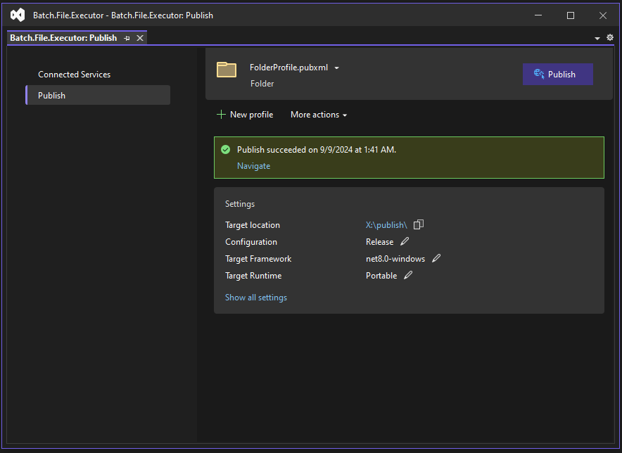
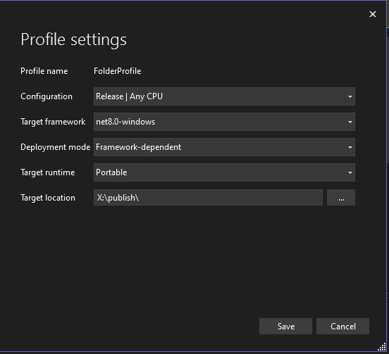

## Setup publish profile




```xml
<?xml version="1.0" encoding="utf-8"?>
<!--
https://go.microsoft.com/fwlink/?LinkID=208121.
-->
<Project>
  <PropertyGroup>
    <Configuration>Release</Configuration>
    <Platform>Any CPU</Platform>
    <PublishDir>X:\publish\</PublishDir>
    <PublishProtocol>FileSystem</PublishProtocol>
    <_TargetId>Folder</_TargetId>
    <TargetFramework>net8.0-windows</TargetFramework>
    <SelfContained>false</SelfContained>
  </PropertyGroup>
</Project>
```

:::note 
Now you can zip this folder and transfer it to another computer. or just start using it.
:::