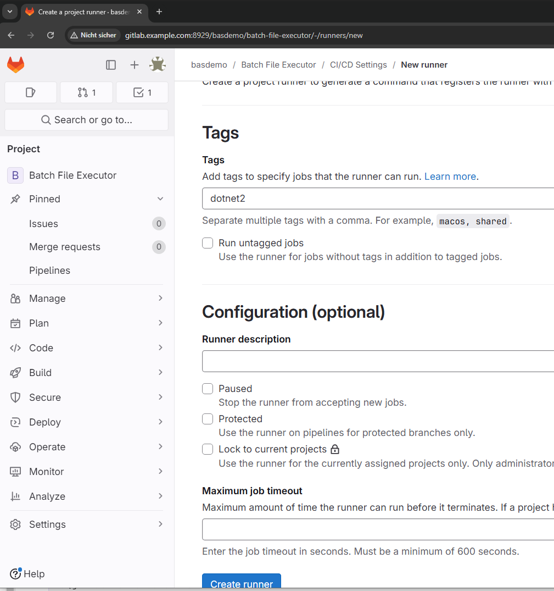
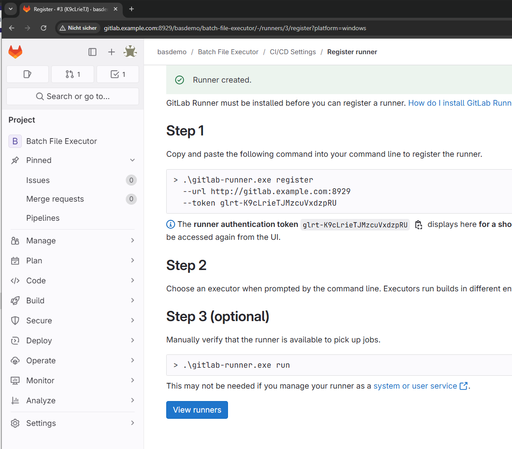

import { Steps, Aside } from '@astrojs/starlight/components';

> CI/CD is a continuous method of software development, where you continuously build, test, deploy, and monitor iterative code changes. This iterative process helps reduce the chance that you develop new code based on buggy or failed previous versions. GitLab CI/CD can catch bugs early in the development cycle, and help ensure that the code deployed to production complies with your established code standards.

<Steps>
1. Create a `.gitlab-ci.yml` file at the root of the project solution folder

    ```yml title=".gitlab-ci.yml"
    # https://gitlab.com/gitlab-org/gitlab/-/blob/main/lib/gitlab/ci/templates/dotNET-Core.gitlab-ci.yml
    image: mcr.microsoft.com/dotnet/sdk:7.0

    variables:
      OBJECTS_DIRECTORY: "obj"
      NUGET_PACKAGES_DIRECTORY: ".nuget"
      SOURCE_CODE_PATH: "*/*/"

    cache:
      key: "$CI_JOB_STAGE-$CI_COMMIT_REF_SLUG"
      paths:
        - "$SOURCE_CODE_PATH$OBJECTS_DIRECTORY/project.assets.json"
        - "$SOURCE_CODE_PATH$OBJECTS_DIRECTORY/*.csproj.nuget.*"
        - "$NUGET_PACKAGES_DIRECTORY"
      policy: pull-push

    before_script:
      - "dotnet restore --packages $NUGET_PACKAGES_DIRECTORY"

    build:
      stage: build
      script:
        - "dotnet build --no-restore"

    deploy:
      stage: deploy
      script: 
        - dotnet publish Batch.File.Executor /p:Configuration=Release /p:PublishProfile=FolderProfile
      environment: production
    ```

2. Install `Gitlab Runner`
    - Download the setup file from the official Gitlab website. [Download link](https://docs.gitlab.com/runner/install/windows.html)
    - The installation is pretty straight forward. Apply the default settings. Make sure the runner is downloaded to the location `C:\gitlab-runner\`

3. Configure `Gitlab Runner`

    - Open the project website in gitlab.
      
    - Assign a name, description (optional)
      
    - Setup the runner on the windows pc
      

      :::caution
      Change the `pwsh` to `powershell` in the `config.toml` file.
      :::

      ```toml title="config.toml"
      concurrent = 1
      check_interval = 0
      shutdown_timeout = 0

      [session_server]
        session_timeout = 1800

      [[runners]]
        name = "basdemo"
        url = "http://gitlab.example.com:8929"
        id = 1
        token = "" ## gitlab-token-here
        token_obtained_at = 2024-09-08T22:39:26Z
        token_expires_at = 0001-01-01T00:00:00Z
        executor = "shell"  
        shell = "powershell"       ## Make sure to change this to `powershell`
        [runners.custom_build_dir]
        [runners.cache]
          MaxUploadedArchiveSize = 0
          [runners.cache.s3]
          [runners.cache.gcs]
          [runners.cache.azure]

      ```


</Steps>